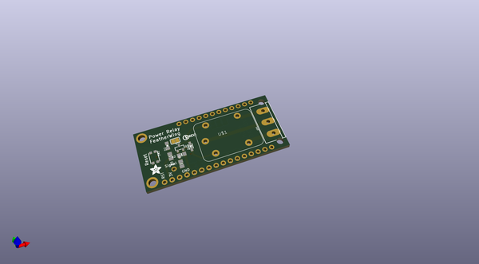
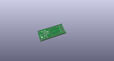
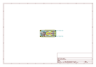
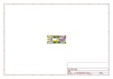
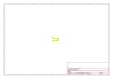
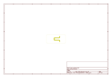
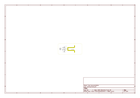

# OOMP Project  
## Adafruit-Power-Relay-FeatherWing-PCB  by adafruit  
  
(snippet of original readme)  
  
-- Adafruit Power Relay FeatherWing PCB  
<a href="http://www.adafruit.com/products/3191">   
Click here to purchase one from the Adafruit shop</a>  
  
This is the Power Relay FeatherWing. It gives you power to control, and control over power. Put simply, you can now turn on and off lamps, fans, solenoids, and other small appliances that run on up to 250VAC or DC power using any Feather board. Compared to our smaller Relay FeatherWings, this one can handle a beefy 1200 Watts!  
  
Works with all/any of our Feather boards, just wire up the relay control pin to whatever GPIO you like! Using our Feather Stacking Headers or Feather Female Headers you can connect a FeatherWing on top of your Feather board and let the board take flight. Check out our range of Feather boards here.  
  
This Wing has a non-latching type relay. You can switch up to 10A of resistive-load current at 120VAC, 5A at 240VAC. With inductive loads, about half that. Check the datasheet for the relay for the exact switching capacity, as it depends on type of load and voltage type and magnitude. This relay is good for handling fairly large devices, computers, TVs, small appliances and more.  
  
PCB files for the Adafruit Power Relay FeatherWing. The format is EagleCAD schematic and board layout  
- https://www.adafruit.com/products/3191  
  
--- License  
  
Adafruit invests time and resources providing this open source design, please support Adafruit and open-source hardware by purcha  
  full source readme at [readme_src.md](readme_src.md)  
  
source repo at: [https://github.com/adafruit/Adafruit-Power-Relay-FeatherWing-PCB](https://github.com/adafruit/Adafruit-Power-Relay-FeatherWing-PCB)  
## Board  
  
  
## Schematic  
  
  
  
[schematic pdf](working_schematic.pdf)  
## Images  
  
  
  
  
  
  
  
  
  
  
  
  
  
  
  
  
