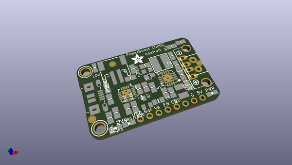
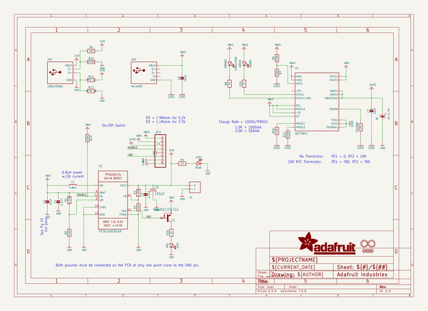
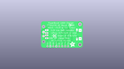
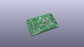
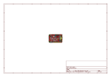
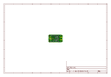
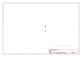
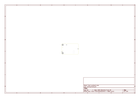
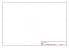
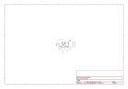

# OOMP Project  
## Adafruit-PowerBoost-1000C  by adafruit  
  
oomp key: oomp_projects_flat_adafruit_adafruit_powerboost_1000c  
(snippet of original readme)  
  
-- Adafruit PowerBoost 1000C  
<a href="http://www.adafruit.com/products/2465">   
Click here to purchase one from the Adafruit shop</a>  
  
PowerBoost 1000C is the perfect power supply for your portable project! With a built-in load-sharing battery charger circuit, you'll be able to keep your power-hungry project running even while recharging the battery! This little DC/DC boost converter module can be powered by any 3.7V LiIon/LiPoly battery, and convert the battery output to 5.2V DC for running your 5V projects.  
  
If you dont need the 1A battery charger, smart load-sharing, or 1A iOS resistors, check out the Powerboost 500C  
  
Like our popular 5V 1A USB wall adapter, we tweaked the output to be 5.2V instead of a straight-up 5.0V so that there's a little bit of 'headroom' for long cables, high draw, the addition of a diode on the output if you wish, etc. The 5.2V is safe for all 5V-powered electronics like Arduino, Raspberry Pi, or Beagle Bone while preventing icky brown-outs during high current draw because of USB cable resistance.  
  
The PowerBoost 1000C has at the heart a TPS61090 boost converter from TI. This boost converter chip has some really nice extras such as low battery detection, 2A internal switch, synchronous conversion, excellent efficiency, and 700KHz high-frequency operation.   
  
PCB files for Adafruit PowerBoost 1000C  
-  https://www.adafruit.com/product/2465  
  
--- License  
  
Adafruit invests time and resources providin  
  full source readme at [readme_src.md](readme_src.md)  
  
source repo at: [https://github.com/adafruit/Adafruit-PowerBoost-1000C](https://github.com/adafruit/Adafruit-PowerBoost-1000C)  
## Board  
  
  
## Schematic  
  
  
  
[schematic pdf](working_schematic.pdf)  
## Images  
  
  
  
  
  
  
  
  
  
  
  
  
  
  
  
  
