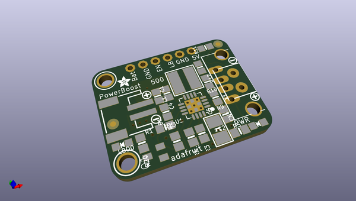
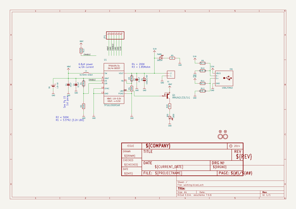
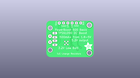
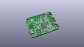
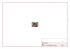
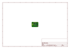
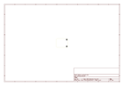
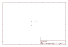
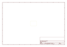
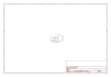

# OOMP Project  
## Adafruit-PowerBoost-500-Basic-PCB  by adafruit  
  
oomp key: oomp_projects_flat_adafruit_adafruit_powerboost_500_basic_pcb  
(snippet of original readme)  
  
-- Adafruit PowerBoost 500 Basic PCB  
<a href="http://www.adafruit.com/products/1903">   
Click here to purchase one from the Adafruit shop</a>  
  
This little DC/DC boost converter module can run from 1.8V batteries or higher, and convert that voltage to 5.2V DC for running your 5V projects. Like our popular 5V 1A USB wall adapter, we tweaked the output to be 5.2V instead of a straight-up 5.0V so that there's a little bit of 'headroom' long cables, high draw, the addition of a diode on the output if you wish, etc. The 5.2V is safe for all 5V-powered electronics like Adafruit Metro/Trinket/Gemma/ItsyBitsy, Arduino, Raspberry Pi, or BeagleBone while preventing icky brown-outs during high current draw because of USB cable resistance.  
  
The PowerBoost 500 has at the heart a TPS61090 boost converter from TI. This boost converter chip has some really nice extras such as low battery detection, 2A internal switch, synchronous conversion, excellent efficiency, and 700KHz high-frequency operation.  
  
These are the Eagle CAD files for the Adafruit Adafruit PowerBoost 500 Basic breakout:  
----> https://www.adafruit.com/product/1903  
  
--- License  
  
Adafruit invests time and resources providing this open source design, please support Adafruit and open-source hardware by purchasing products from [Adafruit](https://www.adafruit.com)!  
  
All text above must be included in any redistribution  
  
Designed by Limor Fried/Ladyada for Adafruit Industries.  
Cre  
  full source readme at [readme_src.md](readme_src.md)  
  
source repo at: [https://github.com/adafruit/Adafruit-PowerBoost-500-Basic-PCB](https://github.com/adafruit/Adafruit-PowerBoost-500-Basic-PCB)  
## Board  
  
  
## Schematic  
  
  
  
[schematic pdf](working_schematic.pdf)  
## Images  
  
  
  
  
  
  
  
  
  
  
  
  
  
  
  
  
