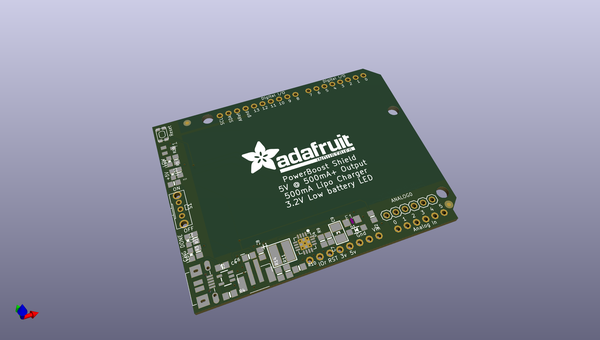
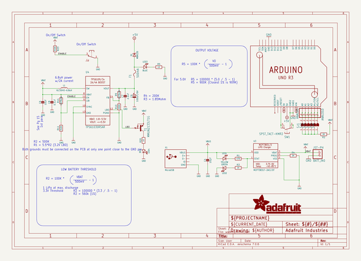
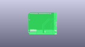
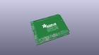
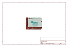
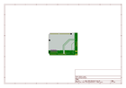
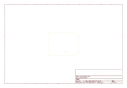
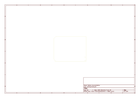
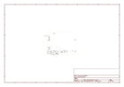

# OOMP Project  
## Adafruit-PowerBoost-500-Shield-PCB  by adafruit  
  
(snippet of original readme)  
  
-- Adafruit PowerBoost 500 Shield PCB  
<a href="http://www.adafruit.com/products/2078">   
Click here to purchase one from the Adafruit shop</a>  
  
The PowerBoost shield! This stackable shield goes onto your Arduino and provides a slim rechargeable power pack, with a built in battery charger as well as DC/DC booster.  
  
Compatible with Adafruit Metro, Arduino Uno, Duemilanove, Mega, Leonardo and Due - basically any Arduino-pinout-shaped Arduino as only the GND and 5V pins are used. You can stack shields on top, or stack the PowerBoost on top. Please note that the powerboost does not pass through the ICSP headers (the battery is in the way) so if your stacking shield uses ICSP for data transfer (like the Ethernet Shield), you'll need to stack the PowerBoost above it!  
  
The PowerBoost shield can run off of any Lithium Ion or Lithium Polymer battery (3.7/4.2V kind) but we suggest our 1200mAh capacity  or 2000mAh capacity batteries, both of which fits very nicely in the empty space of the shield. Plug in the battery and recharge it via the microUSB jack. When you're ready to go, just unplug the Arduino from USB or the wall adapter and it will automatically switch over to shield power. Use only Lipoly batteries with protection circuitry!  
  
The onboard boost converter can provide at least 500mA current, and can peak at 1A. There's an onboard fuse to protect against higher current draws which could damage the boost converter or battery.   
  full source readme at [readme_src.md](readme_src.md)  
  
source repo at: [https://github.com/adafruit/Adafruit-PowerBoost-500-Shield-PCB](https://github.com/adafruit/Adafruit-PowerBoost-500-Shield-PCB)  
## Board  
  
  
## Schematic  
  
  
  
[schematic pdf](working_schematic.pdf)  
## Images  
  
  
  
  
  
  
  
  
  
  
  
  
  
  
  
  
