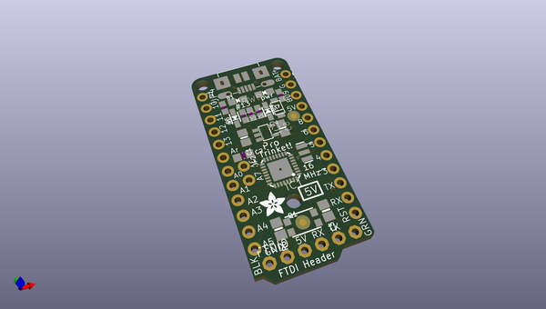
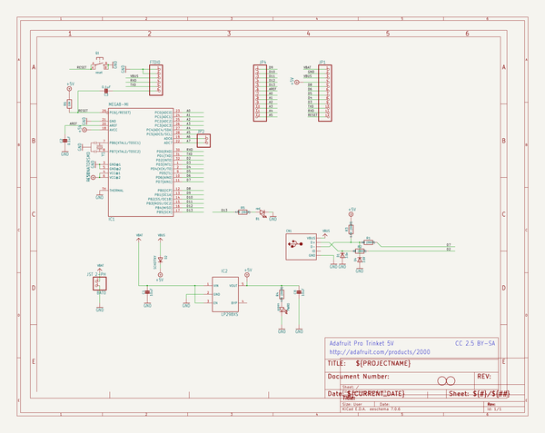
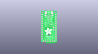
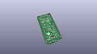
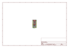
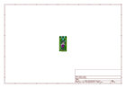
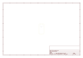
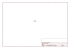
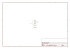

# OOMP Project  
## Adafruit-Pro-Trinket-PCBs  by adafruit  
  
oomp key: oomp_projects_flat_adafruit_adafruit_pro_trinket_pcbs  
(snippet of original readme)  
  
- Adafruit Pro Trinket 3.3V and 5.0V PCB  
&nbsp;    
Click to purchase from the Adafruit Shop:  
- [5V 16 MHz Pro Trinket](https://www.adafruit.com/product/2000)  
- [3V 12 MHz Pro Trinket](https://www.adafruit.com/product/2010)  
  
Pro Trinket combines everything you love about Trinket with the familiarity of the common core Arduino chip, the ATmega328. It's like an Arduino Pro Mini with more pins and USB tossed in, so delicious.  
  
We designed Pro Trinket, with 18 GPIO, 2 extra analog inputs, 28K of flash, and 2K of RAM. Like the Trinket, it has onboard USB bootloading support - we opted for a MicroUSB jack this time. We also added Optiboot support, so you can either program your Pro Trinket over USB or with a FTDI cable just like the Pro Mini and friends.  
  
The Pro Trinket PCB measures only 1.5" x 0.7" x 0.2" (without headers) but packs much of the same capability as an Arduino UNO. So it's great once you've finished up a prototype on an official Arduino UNO and want to make the project smaller.  
  
This is the CAD & PCB data for the Adafruit Pro Trinket 5V and 3.3V versions. The PCB format is EagleCAD schematic and board layout  
  
For more details, check out the product pages at  
  
-----> https://www.adafruit.com/products/2000  
and  
-----> https://www.adafruit.com/products/2010  
  
--- Licen  
  full source readme at [readme_src.md](readme_src.md)  
  
source repo at: [https://github.com/adafruit/Adafruit-Pro-Trinket-PCBs](https://github.com/adafruit/Adafruit-Pro-Trinket-PCBs)  
## Board  
  
  
## Schematic  
  
  
  
[schematic pdf](working_schematic.pdf)  
## Images  
  
  
  
  
  
  
  
  
  
  
  
  
  
  
  
  
