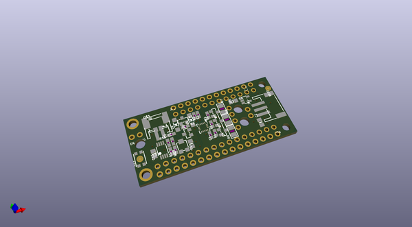
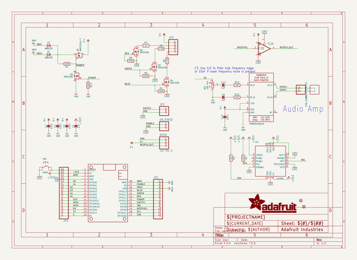
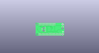
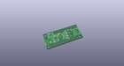
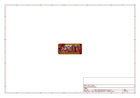
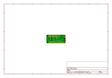
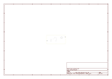
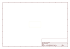
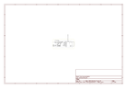

# OOMP Project  
## Adafruit-Prop-Maker-FeatherWing-PCB  by adafruit  
  
oomp key: oomp_projects_flat_adafruit_adafruit_prop_maker_featherwing_pcb  
(snippet of original readme)  
  
-- Adafruit Prop-Maker FeatherWing PCB  
  
<a href="http://www.adafruit.com/products/3988">   
Click here to purchase one from the Adafruit shop</a>  
  
PCB files for the Adafruit Prop-Maker FeatherWing. Format is EagleCAD schematic and board layout  
* https://www.adafruit.com/product/3988  
  
--- Description  
  
The Adafruit Feather series gives you lots of options for a small, portable, rechargeable microcontroller board. Perfect for fitting into your next prop build! This FeatherWing will unlock the prop-maker inside all of us, with tons of stuff packed in to make sabers & swords, props, toys, cosplay pieces, and more.  
  
We looked at hundreds of prop builds, and thought about what would make for a great low-cost (but well-designed) add-on for our Feather boards. Here's what we came up with:  
  
 * **Snap-in NeoPixel port** - With a 3-pin JST connector, you can [plug in one of our JST-wired NeoPixel strips directly](https://www.adafruit.com/product/3919), or use a [3-pin JST connector to wire up your favorite shape of addressable NeoPixel LEDs](https://www.adafruit.com/?q=jst%203-pin). This port provides high current drive from either the Feather Lipoly or USB port, whichever is higher. A level shifter gives you a clean voltage signal to reduce glitchiness no matter what chip you're using  
 * **3W RGB LED drivers** - 3 high current MOSFETs will let you [connect a 3W RGB LED for powerful eye-blasting glory](https://www.adafruit.com/product/2  
  full source readme at [readme_src.md](readme_src.md)  
  
source repo at: [https://github.com/adafruit/Adafruit-Prop-Maker-FeatherWing-PCB](https://github.com/adafruit/Adafruit-Prop-Maker-FeatherWing-PCB)  
## Board  
  
  
## Schematic  
  
  
  
[schematic pdf](working_schematic.pdf)  
## Images  
  
  
  
  
  
  
  
  
  
  
  
  
  
  
  
  
