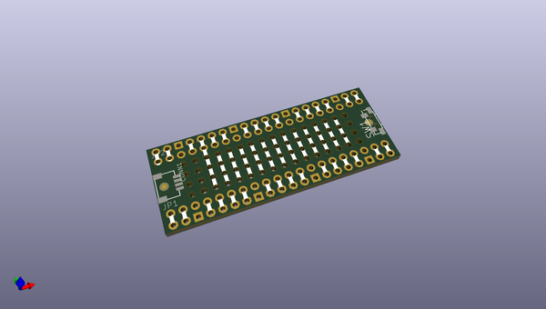
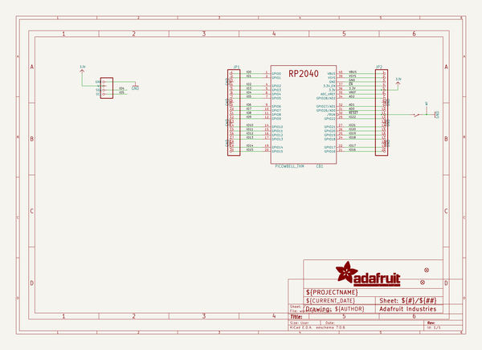
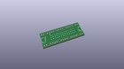
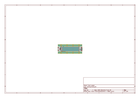
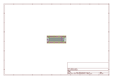
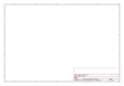
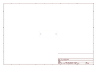
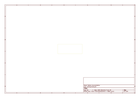
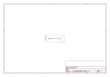

# OOMP Project  
## Adafruit-Proto-PiCowbell-PCB  by adafruit  
  
oomp key: oomp_projects_flat_adafruit_adafruit_proto_picowbell_pcb  
(snippet of original readme)  
  
-- Adafruit PiCowbell Proto for Pico PCB  
  
<a href="http://www.adafruit.com/products/5200">   
Click here to purchase one from the Adafruit shop</a>  
  
PCB files for the Adafruit PiCowbell Proto for Pico.   
  
Format is EagleCAD schematic and board layout  
* https://www.adafruit.com/product/5200  
  
--- Description  
  
Ding dong! Hear that? It's the PiCowbell ringing, letting you know that the new Adafruit PiCowbell Proto is finally in stock and ready to assist your Raspberry Pi Pico and Pico W project with handy hardware and practical prototyping.  
  
The PiCowbell Proto is the same size and shape as a Pico, and is intended to socket underneath to make programming and sensor connectivity easy. Reset button? Yes! STEMMA QT / Qwiic connector for fast I2C? Indeed.   
  
The PiCowbell Proto provides you with:  
* Right angle reset button that sticks out the end  
* Right angle JST SH connector for I2C / Stemma QT / Qwiic connection. Or can use it for plain GPIO wiring if you don't have any I2C devices to attach. Provides 3V, GND, IO4 (SDA), and IO5 (SCL)  
* Extra set of 4 breakout holes next to the JST SH in case you want more I2C connection or want to re-assign the I2C port.  
* 13 rows of 4-hole connected strips in the center area. You can cut the traces between the holes but they're intended to be treated like a mini-mini breadboard  
* Every pad on the Pico has a duplicate hole pad next to it for solder-jumpering  
* The ground pads have white silkscreen  
  full source readme at [readme_src.md](readme_src.md)  
  
source repo at: [https://github.com/adafruit/Adafruit-Proto-PiCowbell-PCB](https://github.com/adafruit/Adafruit-Proto-PiCowbell-PCB)  
## Board  
  
  
## Schematic  
  
  
  
[schematic pdf](working_schematic.pdf)  
## Images  
  
  
  
  
  
  
  
  
  
  
  
  
  
  
  
  
