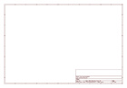

# OOMP Project  
## Adafruit-Proto-Screwshield-PCB  by adafruit  
  
(snippet of original readme)  
  
- Proto-Screwshield (Wingshield) R3 Kit for Arduino  
  
<a href="http://www.adafruit.com/products/196">   
Click here to purchase one from the Adafruit shop  
</a>  
  
The next generation Proto-ScrewShield is a dual-purpose prototyping shield. Not only does it have a large 0.1" grid prototyping area but it also extends the Arduino pins to sturdy, secure, and dependable screw terminal blocks. You even get a few bonus terminals for extra GND and four 'free' terminals for whatever connections you wish! __New! As of June 23, 2014 we now have an R3 update to this design__ - we now have a stacking header for the ICSP 2x3 pins and breakout the SCL and SDA pins. It now works much better with R3 UNO's, Mega, Leonardo, as well as stacking nicely with any shield.  
  
The stack-able wing design allows you slip this under any shield and still get easy access to the "analog" & "digital" ports of the Arduino. The ScrewShield can be stacked above or below pretty much every other shield.  
  
- 1 large high-quality PCB, specifically chosen for its excellent resistance to lots of soldering and desoldering (essential for prototyping boards)  
- Plenty of prototyping space, with power/ground rails  
- Diffused green power LED, extra diffused red LED for user choice (although we suggest to connect it to pin 13)  
- Reset button  
- Full set of stacking female header pins  
- Lots of 3.5mm terminal blocks to fill 36 breakouts on the board  
  
--- License  
  
Adafruit invests   
  full source readme at [readme_src.md](readme_src.md)  
  
source repo at: [https://github.com/adafruit/Adafruit-Proto-Screwshield-PCB](https://github.com/adafruit/Adafruit-Proto-Screwshield-PCB)  
## Board  
  
  
## Schematic  
  
  
  
[schematic pdf](working_schematic.pdf)  
## Images  
  
  
  
  
  
  
  
  
  
  
  
  
  
  
  
  
