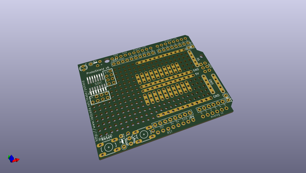
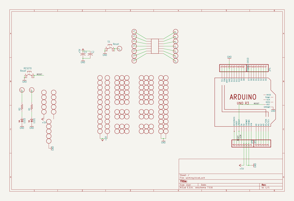
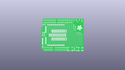
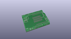
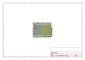
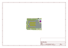
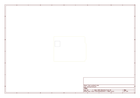
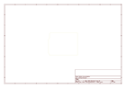
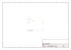

# OOMP Project  
## Adafruit-Proto-Shield-PCB  by adafruit  
  
oomp key: oomp_projects_flat_adafruit_adafruit_proto_shield_pcb  
(snippet of original readme)  
  
-- Adafruit Proto Shield for Arduino Unassembled Kit - Stackable - Version R3 PCB  
  
<a href="http://www.adafruit.com/products/2077">   
Click here to purchase one from the Adafruit shop</a>  
  
PCB files for the Adafruit Proto Shield for Arduino Unassembled Kit - Stackable - Version R3. Format is EagleCAD schematic and board layout  
* https://www.adafruit.com/product/2077  
  
--- Description  
  
This prototyping shield is the best out there (well, we think so, at least), and now is even better with **Version R3** - updated for the most compatibility with just about all the Arduinos! It works with UNO, Mega, Leonardo, NG, Diecimila, Duemilanove, and compatible Arduinos. Yun's and Arduino Ethernets have a chunky Ethernet jack that gets in the way of stacking, you can use the stacking headers included and it will work, just doesn't sit nice and flat.  
  
Check out these awesome specifications:  
  
 * It has a nice standard 0.1"x0.1" prototying grid with big pads  
 * Comes with Stacking headers and plain header, choose whichever you want when soldering together  
 * A IC pattern for adding DIP ICs up to 20 pins  
 * Power rails down the middle and sides  
 * A reset button and an extra general use button  
 * 2 3mm general use LEDs, red and green, as well as 2 matching resistors  
 * A pass-thru ICSP stacking header so you can stack any kind of shield on top, and/or use an AVR programmer  
 * A surface-mount chip area for up to 14 SOIC size parts  
 * Compatib  
  full source readme at [readme_src.md](readme_src.md)  
  
source repo at: [https://github.com/adafruit/Adafruit-Proto-Shield-PCB](https://github.com/adafruit/Adafruit-Proto-Shield-PCB)  
## Board  
  
  
## Schematic  
  
  
  
[schematic pdf](working_schematic.pdf)  
## Images  
  
  
  
  
  
  
  
  
  
  
  
  
  
  
  
  
