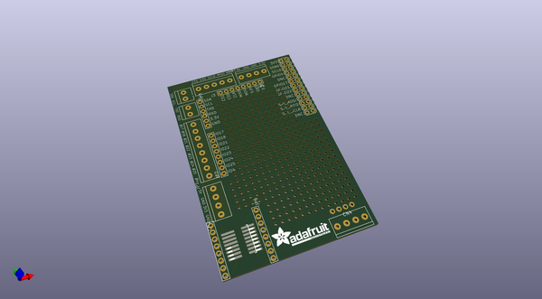
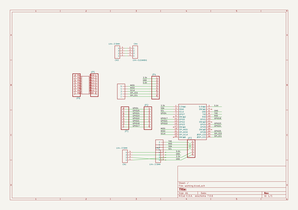
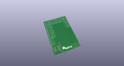
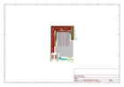
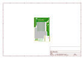
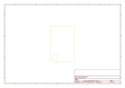
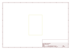
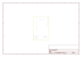

# OOMP Project  
## Adafruit-Prototyping-Pi-Plate-PCB  by adafruit  
  
oomp key: oomp_projects_flat_adafruit_adafruit_prototyping_pi_plate_pcb  
(snippet of original readme)  
  
- Adafruit Prototyping Pi Plate  
  
<a href="http://www.adafruit.com/products/801"> Click here to purchase one from the Adafruit shop</a>  
  
These are the Eagle CAD files for the Adafruit Prototyping Pi Plate.  
  
Now that you've finally got your hands on a [Raspberry Pi®](http://www.raspberrypi.org/) , you're probably itching to make some fun embedded computer projects with it. What you need is an add on prototyping Pi Plate from Adafruit, which can snap onto the Pi PCB (and is removable later if you wish) and gives you all sorts of prototyping goodness to make building on top of the Pi super easy.  
  
__Note: This kit is best used for the Raspberry Pi Model A or Model B.__ You can use it with any "2x20 GPIO type" Pi  (A+, B+, Zero, Pi 2, Pi 3) but only the 'top 26 pins' will be broken out for use  
  
We added lots of basic but essential goodies. First up, there's a big prototyping area, half of which is 'breadboard' style and half of which is 'perfboard' style so you can wire up DIP chips, sensors, and the like. Along the edges of the proto area, all the GPIO/I2C/SPI and power pins are broken out to 0.1" stips so you can easily connect to them. On the edges of the prototyping area, (almost all of) the breakout pins are also connected to labeled 3.5mm screw-terminal blocks. This makes it easy to semi-permanently wire in sensors, LEDs, etc. There's also a 4-block terminal block broken out to 0.1" pads for general non-GPIO wiring. Final  
  full source readme at [readme_src.md](readme_src.md)  
  
source repo at: [https://github.com/adafruit/Adafruit-Prototyping-Pi-Plate-PCB](https://github.com/adafruit/Adafruit-Prototyping-Pi-Plate-PCB)  
## Board  
  
  
## Schematic  
  
  
  
[schematic pdf](working_schematic.pdf)  
## Images  
  
  
  
  
  
  
  
  
  
  
  
  
  
  
  
  
