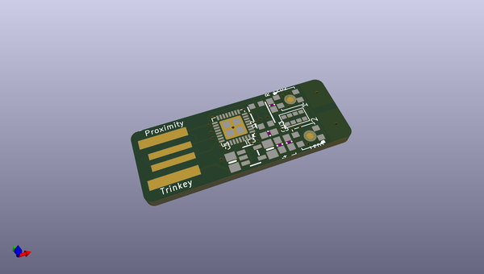
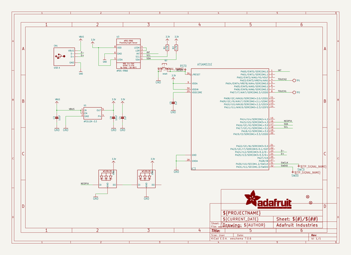
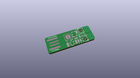
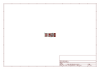
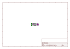
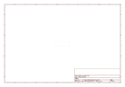
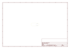
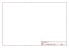
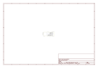

# OOMP Project  
## Adafruit-Proximity-Trinkey-PCB  by adafruit  
  
oomp key: oomp_projects_flat_adafruit_adafruit_proximity_trinkey_pcb  
(snippet of original readme)  
  
-- Adafruit Proximity Trinkey PCB  
  
<a href="http://www.adafruit.com/products/5022">   
Click here to purchase one from the Adafruit shop</a>  
  
PCB files for the Adafruit Proximity Trinkey.   
  
Format is EagleCAD schematic and board layout  
* https://www.adafruit.com/product/5022  
  
--- Description  
  
It's half USB Key, half Adafruit Trinket M0, half APDS9960 breakout...it's Proximity Trinkey, the circuit board with a Trinket M0 heart, APDS9960 Proximity, Light, RGB, and Gesture Sensor, and two RGB NeoPixels for a customizable glow. We wanted to make it super-easy to add one of our most popular combination-sensors to any computer with a USB port and this one is ready to go in an instant.  
  
The PCB is designed to slip into any USB A port on a computer or laptop. There's an ATSAMD21 microcontroller on board with just enough circuitry to keep it happy. One pin of the microcontroller connects to the two NeoPixel LEDs. Two other pins are used as capacitive touch inputs on the end - if you look carefully you can see the slotted end has left and right touch pads. A reset button lets you enter bootloader mode if necessary. That's it!  
  
The SAMD21 can run CircuitPython or Arduino very nicely - both have existing APDS9960, NeoPixel and our FreeTouch (capacitive touch) libraries. Over the USB connection, you can have serial, MIDI, or HID connectivity. The Proximity Trinkey is perfect for simple projects that want to use motion, light or color sen  
  full source readme at [readme_src.md](readme_src.md)  
  
source repo at: [https://github.com/adafruit/Adafruit-Proximity-Trinkey-PCB](https://github.com/adafruit/Adafruit-Proximity-Trinkey-PCB)  
## Board  
  
  
## Schematic  
  
  
  
[schematic pdf](working_schematic.pdf)  
## Images  
  
  
  
  
  
  
  
  
  
  
  
  
  
  
  
  
