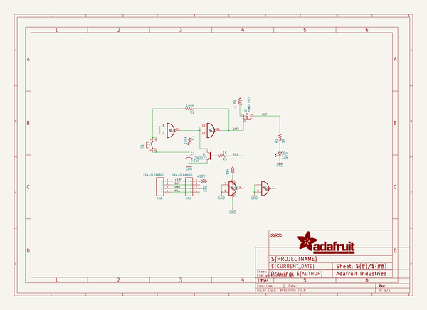

# OOMP Project  
## Adafruit-Push-Button-Power-Switch-PCB  by adafruit  
  
oomp key: oomp_projects_flat_adafruit_adafruit_push_button_power_switch_pcb  
(snippet of original readme)  
  
-- Adafruit Push Button Power Switch PCB  
<a href="http://www.adafruit.com/products/1400">   
Click here to purchase one from the Adafruit shop</a>  
  
The Adafruit Push-button Power Switch is a tidy little design that lets you control a DC power source using an everyday tactile button. The breakout uses a latching analog circuit that is triggered by a push of the button. Press once to turn on, then press again to turn off. The circuit uses a 3A P-FET to connect and disconnect the IN pin to the OUT pin. Works great from 3V to 14VDC and up to 3A (although the FET gets a little toasty at continuous 3A draw) yet has only 0.5uA quiescent current draw.  
  
Using it is easy: connect the power source to Ground and IN, then the load from Ground to OUT. We include a 12mm tactile switch that works well but you can solder in your own switch as well. Press the button (or short the button pins) to alternate between on or off. A on-board red LED will light up when active so you know its working. There's a fourth KILL pin, which you can use to turn off the load and/or keep it off even if the button is pressed. When 1 or more volts is applied it will instantly turn off the FET. This allows your project to turn itself off.  
  
Comes with a assembled & tested bread-board friendly breakout board with four mounting holes, a 12mm tactile button, and some 0.1" male header you can solder to the board to plug it into a breadboard.  
  
PCB files for the Push Bu  
  full source readme at [readme_src.md](readme_src.md)  
  
source repo at: [https://github.com/adafruit/Adafruit-Push-Button-Power-Switch-PCB](https://github.com/adafruit/Adafruit-Push-Button-Power-Switch-PCB)  
## Board  
  
  
## Schematic  
  
  
  
[schematic pdf](working_schematic.pdf)  
## Images  
  
  
  
  
  
  
  
  
  
  
  
  
  
  
  
  
