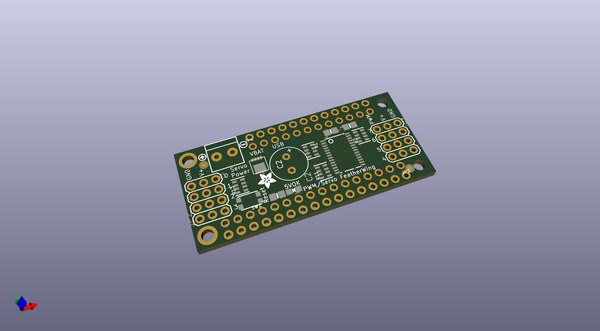
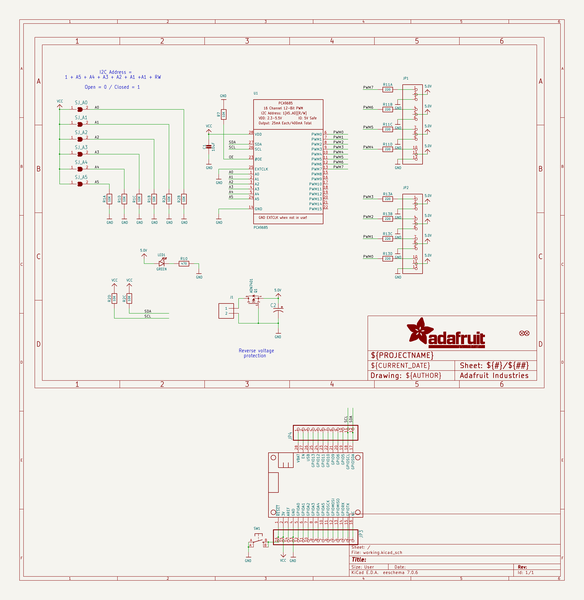
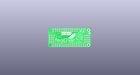
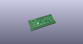
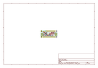
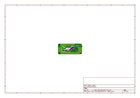
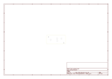
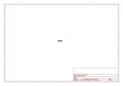
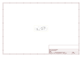

# OOMP Project  
## Adafruit-PWM-Servo-FeatherWing-PCB  by adafruit  
  
(snippet of original readme)  
  
-- Adafruit PWM Servo FeatherWing PCB  
<a href="http://www.adafruit.com/products/2928">   
Click here to purchase one from the Adafruit shop</a>  
  
This is the 8-Channel PWM or Servo​ FeatherWing, you can add 8 x 12-bit PWM outputs to your Feather board. Using our Feather Stacking Headers or Feather Female Headers you can connect a FeatherWing on top or bottom of your Feather board and let the board take flight!  
  
You want to make a cool robot, maybe a hexapod walker, or maybe just a piece of art with a lot of moving parts. Or maybe you want to drive a lot of LEDs with precise PWM output. What now? You could give up OR you could just get our handy PWM and Servo FeatherWing. It's a lot like our popular PWM/Servo Shield but with half the channels & squished into a nice small portable size and works with any of our Feather boards.  
  
This is the PCB for the PCB files for the Adafruit PWM Servo FeatherWing. The format is EagleCAD schematic and board layout  
- https://www.adafruit.com/products/2928  
  
--- License  
  
Adafruit invests time and resources providing this open source design, please support Adafruit and open-source hardware by purchasing products from [Adafruit](https://www.adafruit.com)!  
  
All text above must be included in any redistribution  
  
Designed by Limor Fried/Ladyada for Adafruit Industries.  
Creative Commons Attribution/Share-Alike, all text above must be included in any redistribution.   
See license.txt for additional inf  
  full source readme at [readme_src.md](readme_src.md)  
  
source repo at: [https://github.com/adafruit/Adafruit-PWM-Servo-FeatherWing-PCB](https://github.com/adafruit/Adafruit-PWM-Servo-FeatherWing-PCB)  
## Board  
  
  
## Schematic  
  
  
  
[schematic pdf](working_schematic.pdf)  
## Images  
  
  
  
  
  
  
  
  
  
  
  
  
  
  
  
  
