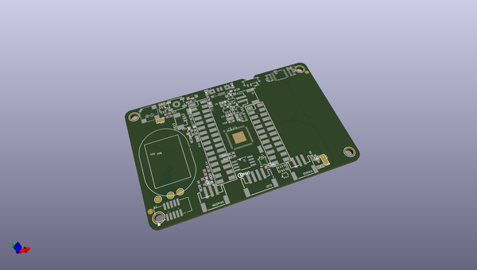
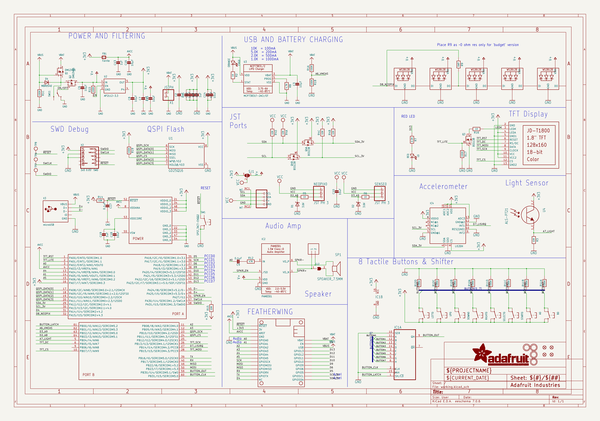
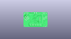
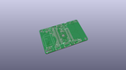
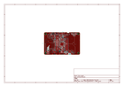
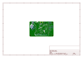
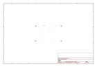
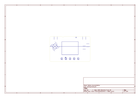
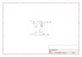

# OOMP Project  
## Adafruit-PyBadge-PCB  by adafruit  
  
(snippet of original readme)  
  
-- Adafruit PyBadge PCB  
  
<a href="http://www.adafruit.com/products/4200">   
Click here to purchase one from the Adafruit shop</a>  
  
PCB files for the Adafruit PyBadge.   
  
Format is EagleCAD schematic and board layout  
* https://www.adafruit.com/product/4200  
  
--- Description  
  
What's the size of a credit card and can run CircuitPython, MakeCode Arcade or Arduino? That's right, its the **Adafruit PyBadge!** We wanted to see how much we could cram into a ​3 3⁄8 × ​2 1⁄8 inch rounded rectangle, to make an all-in-one dev board with a lot of possibilities, and this is what we came up with.  
  
The PyBadge is a compact board, like we said, it's credit card sized. It's powered by our favorite chip, the ATSAMD51, with 512KB of flash and 192KB of RAM. We add 2 MB of QSPI flash for file storage, handy for images, fonts, sounds, or game assets.  
  
On the front you get a 1.8" 160x128 color TFT display with dimmable backlight - we have fast DMA support for drawing so updates are incredibly fast. There's also 8 silicone-top buttons, they are clicky but have a soft button top so they're nice and grippy. The buttons are arranged to mimic a gaming handheld, with a d-pad, 2 menu-select buttons and 2 fire-action buttons. There's also 5 NeoPixel LEDs to dazzle or track activity.  
  
On the back we have a full Feather-compatible header socket set, so you can plug in any FeatherWing to expand the capabilities of the PyBadge. There's also 3 STEMMA connectors   
  full source readme at [readme_src.md](readme_src.md)  
  
source repo at: [https://github.com/adafruit/Adafruit-PyBadge-PCB](https://github.com/adafruit/Adafruit-PyBadge-PCB)  
## Board  
  
  
## Schematic  
  
  
  
[schematic pdf](working_schematic.pdf)  
## Images  
  
  
  
  
  
  
  
  
  
  
  
  
  
  
  
  
