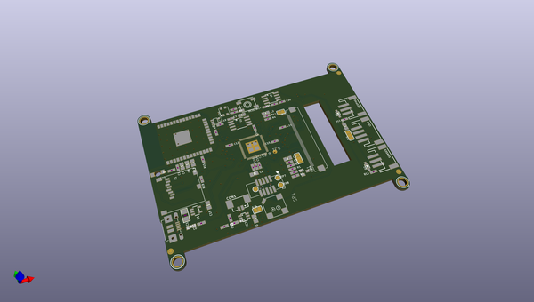

# OOMP Project  
## Adafruit-PyPortal-PCB  by adafruit  
  
(snippet of original readme)  
  
-- Adafruit PyPortal - CircuitPython Powered Internet Display PCB  
  
   
   
   
  
  
PCB files for the Adafruit PyPortal - CircuitPython Powered Internet Display and PyPortal Pynt. Format is EagleCAD schematic and board layout  
* https://www.adafruit.com/product/4116  
* https://www.adafruit.com/product/4465  
* https://www.adafruit.com/product/4444  
  
--- Description  
  
**PyPortal**, our easy-to-use IoT device that allows you to create all the things for the “Internet of Things” in minutes. Make custom touch screen interface GUIs, all open-source, and Python-powered using tinyJSON / APIs to get news, stock, weather, cat photos, and more – all over Wi-Fi with the latest technologies. Create little pocket universes of joy that connect to something good. Rotate it 90 degrees, it’s a web-connected conference badge -badgelife.  
  
The PyPortal uses an ATMEL (Microchip) ATSAMD51J20, and an Espressif ESP32 Wi-Fi coprocessor with TLS/SSL support built-in. PyPortal has a **3.2″ 320 x 240 color TFT** with resistive touch screen. PyPortal includes: speaker, light sensor, temperature sensor, NeoPixel, microSD card slot, 8MB flash, plug-in ports for I2C and 2 analog/digital pins, 3D files for custom enclosures / lanyard fastening. Open-source hardware, and Open-Source software, CircuitPython and Arduino. The device shows up as a USB drive and the c  
  full source readme at [readme_src.md](readme_src.md)  
  
source repo at: [https://github.com/adafruit/Adafruit-PyPortal-PCB](https://github.com/adafruit/Adafruit-PyPortal-PCB)  
## Board  
  
  
## Schematic  
  
  
  
[schematic pdf](working_schematic.pdf)  
## Images  
