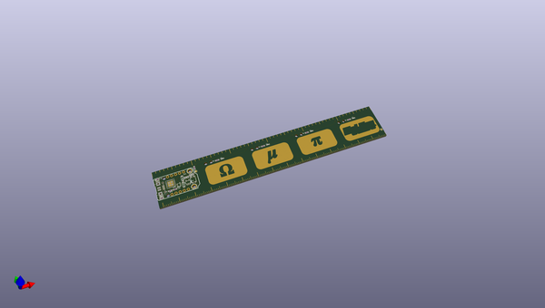
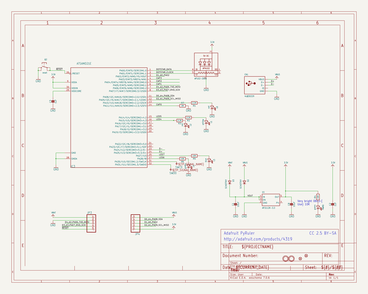
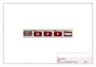
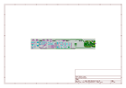
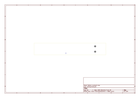
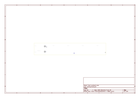
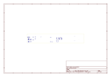
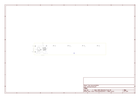

# OOMP Project  
## Adafruit-PyRuler-PCB  by adafruit  
  
(snippet of original readme)  
  
-- Adafruit PyRuler - Engineer Reference Ruler with CircuitPython PCB  
  
<a href="http://www.adafruit.com/products/4319">   
Click here to purchase one from the Adafruit shop</a>  
  
PCB files for the Adafruit PyRuler - Engineer Reference Ruler with CircuitPython.   
  
Format is EagleCAD schematic and board layout  
* https://www.adafruit.com/product/4319  
  
--- Description  
  
The first time you soldered up a surface mount component you may have been surprised "these are really small parts!" and there's dozens of different names too! QFN, TDFN, SOIC, SOP, J-Lead, what do they mean and how can you tell how big they are? Now you can have a reference board at your fingertips, with this snazzy PCB reference ruler.  
  
Measuring approx 1" x 6", this standard-thickness FR4, this gold plated ruler has the most common component packages you'll encounter. It also has font size guide, trace-width diagram, and a set of AWG-sized drills so you can gauge your wire thicknesses.  
  
That's not all, its even a fully featured microcontroller board! Embedded in the end is a Trinket M0, our little Cortex M0+ development board, and in addition, there's 4 capacitive touch pads with matching LEDs that our code will turn into a specialized engineer keyboard. We're always needing to type Ω and µ but we can never memorize the complex key-commands necessary. Thanks to CircuitPython, its super-easy to make a touch keyboard to solve this for you. Plug in the ruler into yo  
  full source readme at [readme_src.md](readme_src.md)  
  
source repo at: [https://github.com/adafruit/Adafruit-PyRuler-PCB](https://github.com/adafruit/Adafruit-PyRuler-PCB)  
## Board  
  
  
## Schematic  
  
  
  
[schematic pdf](working_schematic.pdf)  
## Images  
  
  
  
  
  
  
  
  
  
  
  
  
  
  
  
  
