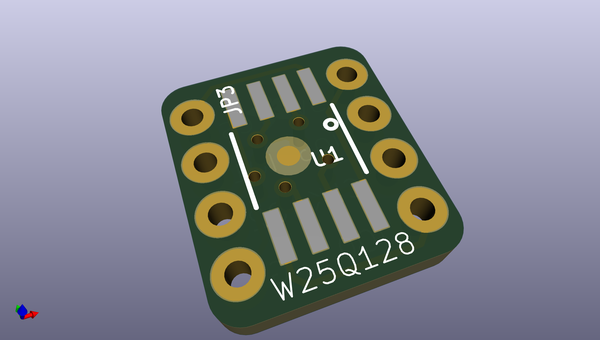
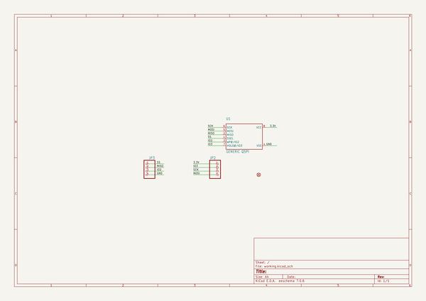
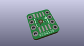
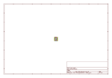
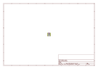
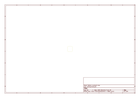
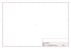
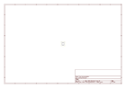

# OOMP Project  
## Adafruit-QSPI-DIP-Breakout-PCB  by adafruit  
  
(snippet of original readme)  
  
-- Adafruit QSPI DIP Breakout Board PCB  
  
<a href="http://www.adafruit.com/products/5632">   
Click here to purchase one from the Adafruit shop</a>  
  
<a href="http://www.adafruit.com/products/5633">   
Click here to purchase one from the Adafruit shop</a>  
  
<a href="http://www.adafruit.com/products/5634">   
Click here to purchase one from the Adafruit shop</a>  
  
PCB files for the Adafruit QSPI DIP Breakout Board.   
  
Format is EagleCAD schematic and board layout  
* https://www.adafruit.com/product/5632  
* https://www.adafruit.com/product/5633  
* https://www.adafruit.com/product/5634  
  
--- Description  
  
For many modern and powerful chips like the RP2040, ESP32, RT10xx and STM32 series microcontrollers, designers can save money and reduce the number of chip options by not including building in the Flash memory used to store code and resources. Instead, an external QSPI Flash memory chip is wired up that can provide 16-128 Megabytes of memory (5632 - 16MB, 5633 - 64MB, 5634 - 128MB. It's not as fast as if it were on the microcontroller internal bus but with Quad SPI I/O and some clever caching by the chip designer, it's pretty effective!  
  
To make prototyping and designing with QSPI flash a little easier, we designed these breakouts that convert the wide 8-SOIC packages to a cute 0.3" wide DIP. We find these handy when testing out diffe  
  full source readme at [readme_src.md](readme_src.md)  
  
source repo at: [https://github.com/adafruit/Adafruit-QSPI-DIP-Breakout-PCB](https://github.com/adafruit/Adafruit-QSPI-DIP-Breakout-PCB)  
## Board  
  
  
## Schematic  
  
  
  
[schematic pdf](working_schematic.pdf)  
## Images  
  
  
  
  
  
  
  
  
  
  
  
  
  
  
  
  
