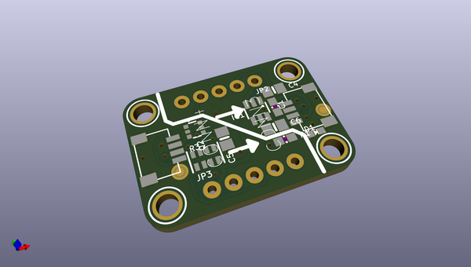
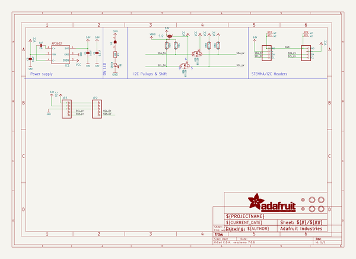
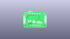
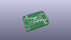
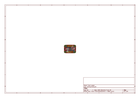
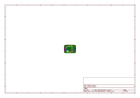
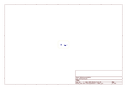
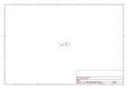

# OOMP Project  
## Adafruit-QT-3V-to-5V-Level-Booster-PCB  by adafruit  
  
(snippet of original readme)  
  
-- Adafruit QT 3V to 5V Level Booster Breakout - STEMMA QT / Qwiic PCB  
  
<a href="http://www.adafruit.com/products/5649">   
Click here to purchase one from the Adafruit shop</a>  
  
PCB files for the Adafruit QT 3V to 5V Level Booster Breakout - STEMMA QT.   
  
Format is EagleCAD schematic and board layout  
* https://www.adafruit.com/product/5649  
  
--- Description  
  
If you're looking to use the Qwiic / Stemma QT standard for your next project - but you're using a sensor or device that requires 5V power or logic, this board is designed for you! It will let you use the 3V power and logic from your Raspberry Pi, or ARM Cortex microcontroller, and boost/shift it up to 5V for use with older or high-power devices that aren't happy with only 3V.  
  
These days, almost every microcontroller / microcomputer board has 3V power and logic: ESP32 series, ATSAMD chips, RP2040 boards, micro:bits, etc! But we still see sensors and devices here and there that really want 5V power or logic. Like this Sensirion SEN54 which has a small motor with 5V power requirements.  
  
On one side of this board is 3V power and logic level inputs. In the middle is a 5V charge-pump boosting regulator that can provide 100mA continuous (250mA peak) plus level shifting circuitry. On the opposite side is the same I2C traffic but now safely shifted up to 5V. If you happen to be using a board that wants 5V power, but 3V logic I2C, there's a solder jumper on the back you can cut/s  
  full source readme at [readme_src.md](readme_src.md)  
  
source repo at: [https://github.com/adafruit/Adafruit-QT-3V-to-5V-Level-Booster-PCB](https://github.com/adafruit/Adafruit-QT-3V-to-5V-Level-Booster-PCB)  
## Board  
  
  
## Schematic  
  
  
  
[schematic pdf](working_schematic.pdf)  
## Images  
  
  
  
  
  
  
  
  
  
  
  
  
  
  
  
  
