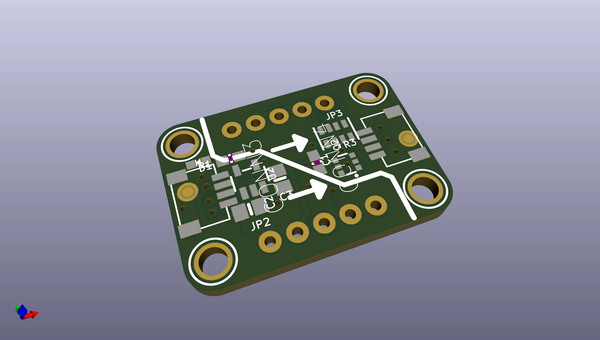
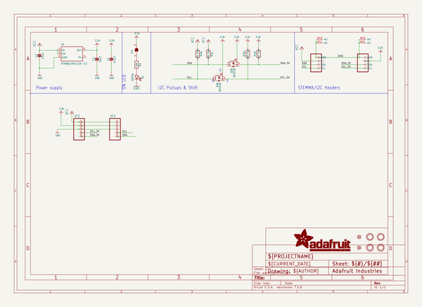
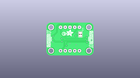
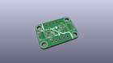
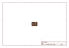
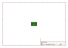
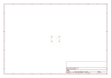
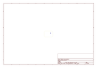
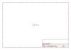

# OOMP Project  
## Adafruit-QT-5-3V-Shifter-PCB  by adafruit  
  
(snippet of original readme)  
  
-- Adafruit QT 5-3V Shifter Breakout - STEMMA QT/Qwiic PCB  
  
<a href="http://www.adafruit.com/products/5637">   
Click here to purchase one from the Adafruit shop</a>  
  
PCB files for the Adafruit QT 5-3V Shifter Breakout - STEMMA QT/Qwiic.   
  
Format is EagleCAD schematic and board layout  
* https://www.adafruit.com/product/5637  
  
--- Description  
  
If you're hankerin' to use the new Qwiic / Stemma QT standard for your next project - but you're still using a classic Arduino UNO or other 5V microcontroller, this board is designed for you! Note that Adafruit QT boards are all 3V and 5V safe but many other Qwiic and other I2C devices are not 5V safe or compatible. That means that if you use wires to connect a Qwiic board to a 5V microcontroller you risk damaging your shiny new I2C sensor with over-high voltages. Unless, of course you have one of these Adafruit QT 5V to 3V Shifter Breakouts  
  
On one side is 5V-safe power and logic input. In the middle is a 3.3V regulator that can provide 500mA plus level shifting circuitry. On the opposite side is the same I2C traffic but now safely shifted down to 3.3V to allow usage with the vast number of sensors and devices that are not 5V safe.  
  
It's simple but very effective! You also get breadboard breakout pins for breadboard usage so it can also be used as a QT-to-perfboard adapter.  
  
The STEMMA QT connectors on either side are compatible with the  I2C connectors. This allows you to make solderle  
  full source readme at [readme_src.md](readme_src.md)  
  
source repo at: [https://github.com/adafruit/Adafruit-QT-5-3V-Shifter-PCB](https://github.com/adafruit/Adafruit-QT-5-3V-Shifter-PCB)  
## Board  
  
  
## Schematic  
  
  
  
[schematic pdf](working_schematic.pdf)  
## Images  
  
  
  
  
  
  
  
  
  
  
  
  
  
  
  
  
