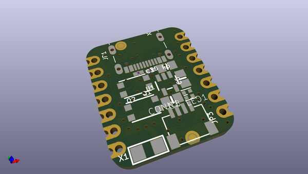
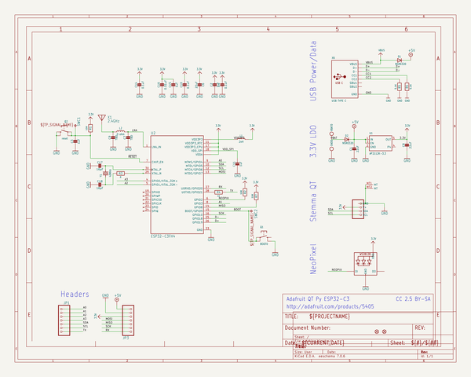
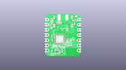
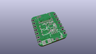
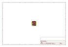
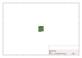
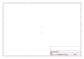
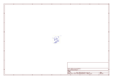

# OOMP Project  
## Adafruit-QT-Py-ESP32-C3-PCB  by adafruit  
  
(snippet of original readme)  
  
-- Adafruit QT Py ESP32-C3 WiFi Dev Board with STEMMA QT PCB  
  
<a href="http://www.adafruit.com/products/5405">   
Click here to purchase one from the Adafruit shop</a>  
  
PCB files for the Adafruit QT Py ESP32-C3 WiFi Dev Board with STEMMA QT.   
  
Format is EagleCAD schematic and board layout  
* https://www.adafruit.com/product/5405  
  
--- Description  
  
What's life without a little RISC? This miniature dev board is perfect for small projects: it comes with our favorite connector - the STEMMA QT, a chainable I2C port, WiFi, Bluetooth LE, and plenty of FLASH and RAM memory for many IoT projects. What a cutie pie! Or is it... a QT Py? This diminutive dev board comes with a RISC-V IoT microcontroller, the ESP32-C3!  
  
ESP32-C3 is a low-cost microcontroller from Espressif that supports 2.4 GHz Wi-Fi and Bluetooth® Low Energy (Bluetooth LE). It has built-in USB-to-Serial, but not native USB - it cannot act as a keyboard or disk drive. The chip used here has 4MB of Flash memory, 400 KB of SRAM and can easily handle TLS connections.  
  
The ESP32-C3 integrates a rich set of peripherals, ranging from UART, I2C, I2S, remote control peripheral, LED PWM controller, general DMA controller, TWAI controller, USB Serial/JTAG controller, temperature sensor, and ADC. It also includes SPI, Dual SPI, and Quad SPI interfaces. There is no DAC or native capacitive touch.  
  
There's a minimum number of pins on this chip, it's specifically designed to be low cost   
  full source readme at [readme_src.md](readme_src.md)  
  
source repo at: [https://github.com/adafruit/Adafruit-QT-Py-ESP32-C3-PCB](https://github.com/adafruit/Adafruit-QT-Py-ESP32-C3-PCB)  
## Board  
  
  
## Schematic  
  
  
  
[schematic pdf](working_schematic.pdf)  
## Images  
  
  
  
  
  
  
  
  
  
  
  
  
  
  
  
  
