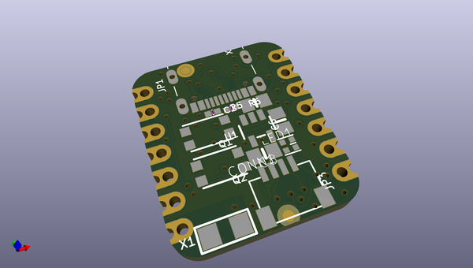
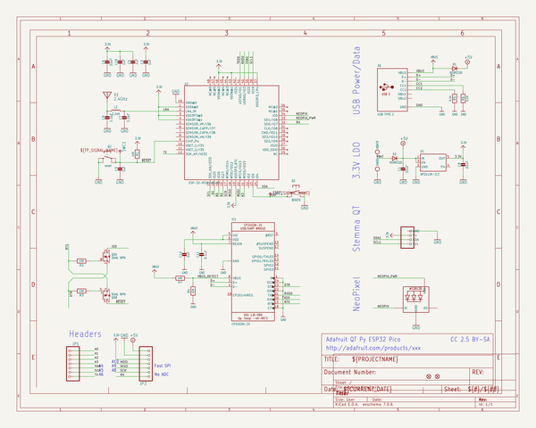
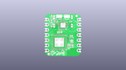
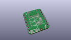
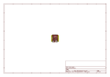
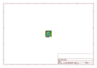
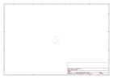
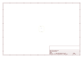
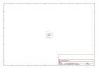

# OOMP Project  
## Adafruit-QT-Py-ESP32-Pico-PCB  by adafruit  
  
(snippet of original readme)  
  
-- Adafruit QT Py ESP32 Pico - WiFi Dev Board with STEMMA QT  
  
<a href="http://www.adafruit.com/products/5395">   
Click here to purchase one from the Adafruit shop</a>  
  
PCB files for the Adafruit QT Py ESP32 Pico.  
  
Format is EagleCAD schematic and board layout  
* https://www.adafruit.com/product/5395  
  
--- Description  
  
This dev board is like when you're watching a super-hero movie and the protagonist shows up in a totally amazing costume in the third act and you're like 'OMG! That's the hero and they're here to kick some serious butt!" but in this case its a microcontroller.  
  
This QT Py board is a thumbnail-sized PCB that features the ESP32 Pico V3 02, an all-in-one chip that has an ESP32 chip with dual-core 240MHz Tensilica processor, WiFi and Bluetooth classic + BLE, adds a bunch of required passives and oscillator, 8 MB of Flash memory and 2 MB of PSRAM. We add a USB to serial converter chip, some more passives, an antenna, USB C, buttons, NeoPixel and QT connector to outfit this super-hero chip for any task you want to throw it at.  
  
At the core of ESP32-PICO-V3-02 is the ESP32 (ECO V3) chip, which is a single 2.4 GHz Wi-Fi and Bluetooth combo chip designed with TSMC’s 40 nm low-power technology. ESP32-PICO-V3-02 integrates all peripheral components seamlessly, including a crystal oscillator, flash, PSRAM, filter capacitors, and RF matching links in one single package. This makes it perfect for stuffing into such a small sp  
  full source readme at [readme_src.md](readme_src.md)  
  
source repo at: [https://github.com/adafruit/Adafruit-QT-Py-ESP32-Pico-PCB](https://github.com/adafruit/Adafruit-QT-Py-ESP32-Pico-PCB)  
## Board  
  
  
## Schematic  
  
  
  
[schematic pdf](working_schematic.pdf)  
## Images  
  
  
  
  
  
  
  
  
  
  
  
  
  
  
  
  
