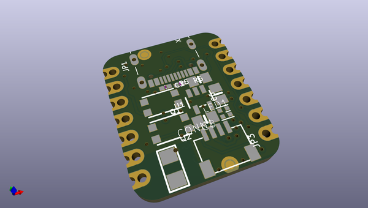
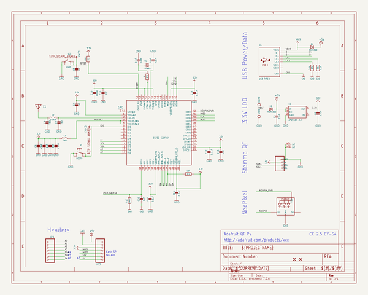
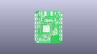
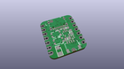
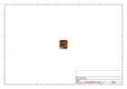
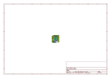
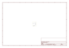
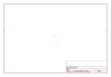
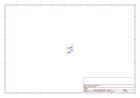
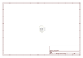

# OOMP Project  
## Adafruit-QT-Py-ESP32-S2-PCB  by adafruit  
  
oomp key: oomp_projects_flat_adafruit_adafruit_qt_py_esp32_s2_pcb  
(snippet of original readme)  
  
-- Adafruit QT Py ESP32-S2 WiFi Dev Board with STEMMA QT PCB  
  
<a href="http://www.adafruit.com/products/5325">   
Click here to purchase one from the Adafruit shop</a>  
  
PCB files for the Adafruit QT Py ESP32-S2 WiFi Dev Board with STEMMA QT.   
  
Format is EagleCAD schematic and board layout  
* https://www.adafruit.com/product/5325  
  
--- Description  
  
What has your favorite Espressif WiFi microcontroller, comes with our favorite connector - the STEMMA QT, a chainable I2C port, and has lots of Flash and RAM memory for your next IoT project? What will make your next IoT project flyyyyy? What a cutie pie! Or is it... a QT Py? This diminutive dev board comes with one of our new favorite lil chips, the ESP32-S2!   
  
The ESP32-S2 is a highly-integrated, low-power, 2.4 GHz Wi-Fi System-on-Chip (SoC) solution that now has built-in native USB as well as some other interesting new technologies like Time of Flight distance measurements. With its state-of-the-art power and RF performance, this SoC is an ideal choice for a wide variety of application scenarios relating to the Internet of Things (IoT), wearable electronics, and smart homes.  
  
Please note the QT Py ESP32-S2 has a single-core 240 MHz chip, so it won't be as fast as ESP32's with dual-core. Also, there is no Bluetooth support. However, we are super excited about the ESP32-S2's native USB which unlocks a lot of capabilities for advanced interfacing! This ESP32-S2 mini-module we are usi  
  full source readme at [readme_src.md](readme_src.md)  
  
source repo at: [https://github.com/adafruit/Adafruit-QT-Py-ESP32-S2-PCB](https://github.com/adafruit/Adafruit-QT-Py-ESP32-S2-PCB)  
## Board  
  
  
## Schematic  
  
  
  
[schematic pdf](working_schematic.pdf)  
## Images  
  
  
  
  
  
  
  
  
  
  
  
  
  
  
  
  
