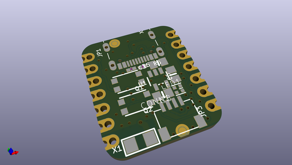
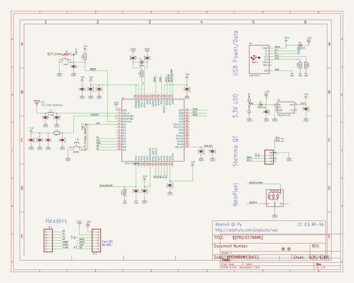
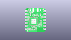
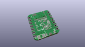
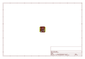
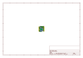
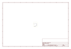
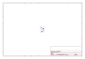
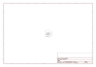

# OOMP Project  
## Adafruit-QT-Py-ESP32-S3-PCB  by adafruit  
  
(snippet of original readme)  
  
-- Adafruit QT Py ESP32-S3 WiFi Dev Board PCB  
  
<a href="http://www.adafruit.com/products/5426">   
Click here to purchase one from the Adafruit shop</a>  
  
PCB files for the Adafruit QT Py ESP32-S3 WiFi Dev Board.   
  
Format is EagleCAD schematic and board layout  
* https://www.adafruit.com/product/5426  
  
--- Description  
  
The ESP32-S3 has arrived in QT Py format - and what a great way to get started with this powerful new chip from Espressif! With dual 240 MHz cores, WiFi and BLE support, and native USB, this QT Py is great for powering your IoT projects.  
  
The ESP32-S3 is a highly-integrated, low-power, 2.4 GHz Wi-Fi System-on-Chip (SoC) solution that now has WiFi and BLE support, built-in native USB as well as some other interesting new technologies like Time of Flight distance measurements. With its state-of-the-art power and RF performance, this SoC is an ideal choice for a wide variety of application scenarios relating to the Internet of Things (IoT), wearable electronics, and smart homes.   
  
With native USB and 8 MB Flash this board will let you upgrade your existing ESP32 projects. Native USB means it can act like a keyboard or a disk drive, and no external USB-to-Serial converter required. WiFi and BLE mean it's awesome for IoT projects.  
  
OLEDs! Inertial Measurement Units! Sensors a-plenty. All plug-and-play thanks to the innovative chainable design: SparkFun Qwiic-compatible STEMMA QT connectors for the I2C bus so you don't  
  full source readme at [readme_src.md](readme_src.md)  
  
source repo at: [https://github.com/adafruit/Adafruit-QT-Py-ESP32-S3-PCB](https://github.com/adafruit/Adafruit-QT-Py-ESP32-S3-PCB)  
## Board  
  
  
## Schematic  
  
  
  
[schematic pdf](working_schematic.pdf)  
## Images  
  
  
  
  
  
  
  
  
  
  
  
  
  
  
  
  
