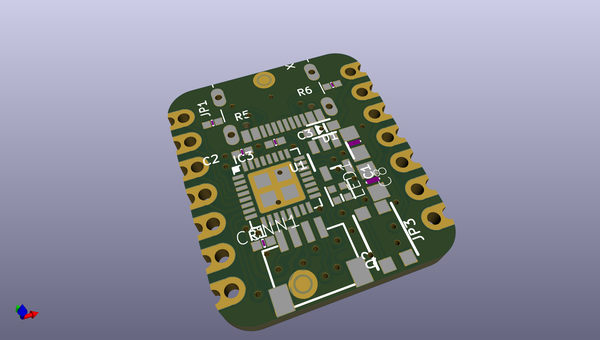
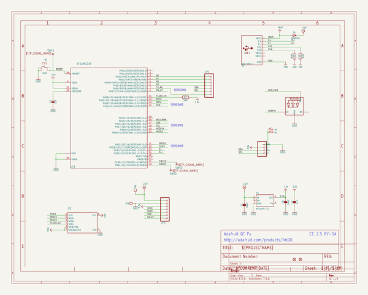
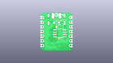
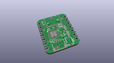
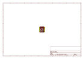
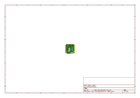
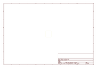
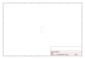
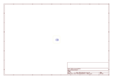
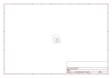

# OOMP Project  
## Adafruit-QT-Py-PCB  by adafruit  
  
oomp key: oomp_projects_flat_adafruit_adafruit_qt_py_pcb  
(snippet of original readme)  
  
-- Adafruit QT Py PCB  
  
<a href="http://www.adafruit.com/products/4600">   
Click here to purchase one from the Adafruit shop</a>  
  
PCB files for the Adafruit QT Py.  
  
Format is EagleCAD schematic and board layout  
* https://www.adafruit.com/product/4600  
  
--- Description  
  
What a cutie pie! Or is it... a QT Py? This diminutive dev board comes with our favorite lil chip, the SAMD21 (as made famous in our GEMMA M0 and Trinket M0 boards).  
  
This time it comes with our favorite connector - the STEMMA QT, a chainable I2C port that can be used with any of our STEMMA QT sensors and accessories.  
  
OLEDs! Inertial Measurment Units! Sensors a-plenty. All plug-and-play thanks to the innovative chainable design: SparkFun Qwiic-compatible STEMMA QT connectors for the I2C bus so you don't even need to solder! Just plug in a compatible cable and attach it to your MCU of choice, and you’re ready to load up some software and measure some light.  
  
Use any SparkFun Qwiic boards! Seeed Grove I2C boards will also work with this adapter cable.  
  
Pinout and shape is Seeed Xiao compatible, with castellated pads so you can solder it flat to a PCB. In addition to the QT connector, we also added an RGB NeoPixel (with controllable power pin to allow for ultra-low-power usage), and a reset button (great for restarting your program, or entering the bootloader)  
  
Runs Arduino like a dream, and can be used for basic CircuitPython projects. For more advanced usage li  
  full source readme at [readme_src.md](readme_src.md)  
  
source repo at: [https://github.com/adafruit/Adafruit-QT-Py-PCB](https://github.com/adafruit/Adafruit-QT-Py-PCB)  
## Board  
  
  
## Schematic  
  
  
  
[schematic pdf](working_schematic.pdf)  
## Images  
  
  
  
  
  
  
  
  
  
  
  
  
  
  
  
  
