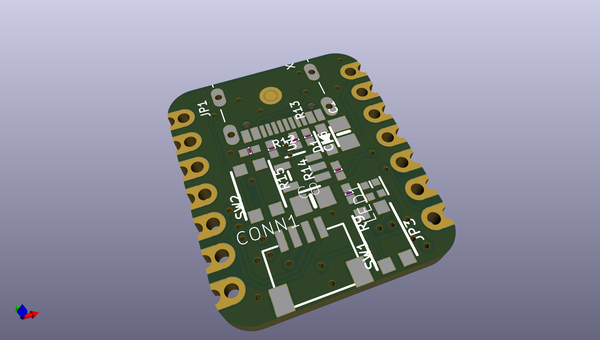
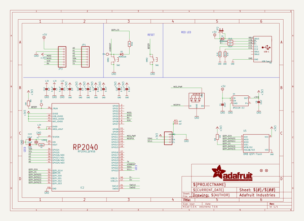
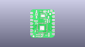
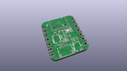
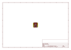
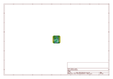
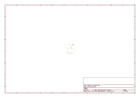
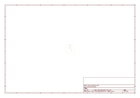
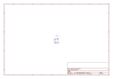
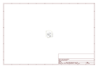

# OOMP Project  
## Adafruit-QT-Py-RP2040-PCB  by adafruit  
  
oomp key: oomp_projects_flat_adafruit_adafruit_qt_py_rp2040_pcb  
(snippet of original readme)  
  
-- Adafruit QT Py RP2040 PCB  
  
<a href="http://www.adafruit.com/products/4900">   
Click here to purchase one from the Adafruit shop</a>  
  
PCB files for the Adafruit QT Py RP2040.  
  
Format is EagleCAD schematic and board layout  
* https://www.adafruit.com/product/4900  
  
--- Description  
  
What a cutie pie! Or is it... a QT Py? This diminutive dev board comes with one of our new favorite chip, the RP2040. It's been made famous in the new Raspberry Pi Pico and our Feather RP2040 and ItsyBitsy RP2040, but what if we wanted something really smol?  
  
A new chip means a new QT Py, and the Raspberry Pi RP2040 is no exception. When we saw this chip we thought "this chip is going to be awesome when we give it the cuuutie QT Py Treatment", and so we did! This QT Py features the RP2040, and all niceties you know and love about the original QT Py  
  
---- Plug-and-play STEMMA QT  
  
The star of the QT Py is our favorite connector - the STEMMA QT, a chainable I2C port that can be used with any of our STEMMA QT sensors and accessories. Having this connector means you don't need to do any soldering to get started.  
  
What can you pop into the QT port? How about OLEDs! Inertial Measurment Units! Sensors a-plenty. All plug-and-play thanks to the innovative chainable design: SparkFun Qwiic-compatible STEMMA QT connectors for the I2C bus so you don't even need to solder. Just plug in a compatible cable and attach it to your MCU of choice, and you’re ready to l  
  full source readme at [readme_src.md](readme_src.md)  
  
source repo at: [https://github.com/adafruit/Adafruit-QT-Py-RP2040-PCB](https://github.com/adafruit/Adafruit-QT-Py-RP2040-PCB)  
## Board  
  
  
## Schematic  
  
  
  
[schematic pdf](working_schematic.pdf)  
## Images  
  
  
  
  
  
  
  
  
  
  
  
  
  
  
  
  
