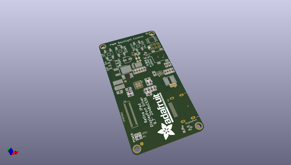
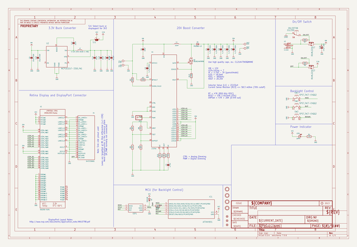
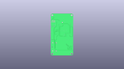
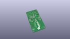
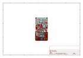
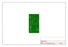
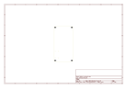
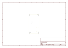
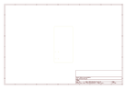
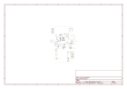

# OOMP Project  
## Adafruit-Qualia-Driver-PCB  by adafruit  
  
oomp key: oomp_projects_flat_adafruit_adafruit_qualia_driver_pcb  
(snippet of original readme)  
  
-- Adafruit Qualia Driver PCB  
  
<a href="http://www.adafruit.com/products/1716">   
Click here to purchase one from the Adafruit shop</a>  
  
PCB files for the Adafruit Qualia Driver. Format is EagleCAD schematic and board layout  
* https://www.adafruit.com/product/1716  
  
--- DESCRIPTION  
The Qualia Retina driver board is a work of art (it was designed by resident engineer KTOWN). It's used in the Adafruit Qualia 9.7" DisplayPort Monitor Kit and we use the really awesome LT3754 as a 12-channel constant current driver with individual backlight string channel control. This gives the backlight perfect consistency over any usage or temperature range. A ATtiny85 handles the backlight dimming and soft on/off, so you can PWM the backlight over a range to get the look you want.  
  
This driver is available for advanced users only! The Molex connector that is used to connect to the LG display is insanely delicate and breaks very very very easily if you are not very careful! If you order this driver board and break the connector, it may no longer work and we cannot repair it. If you break it you may have to buy another driver. We do not offer any returns, refunds or replacements! Do not purchase if you are not comfortable with this risk!  
  
--- License  
  
Adafruit invests time and resources providing this open source design, please support Adafruit and open-source hardware by purchasing products from [Adafruit.com](https://www.adafruit.com)!  
  
Desi  
  full source readme at [readme_src.md](readme_src.md)  
  
source repo at: [https://github.com/adafruit/Adafruit-Qualia-Driver-PCB](https://github.com/adafruit/Adafruit-Qualia-Driver-PCB)  
## Board  
  
  
## Schematic  
  
  
  
[schematic pdf](working_schematic.pdf)  
## Images  
  
  
  
  
  
  
  
  
  
  
  
  
  
  
  
  
