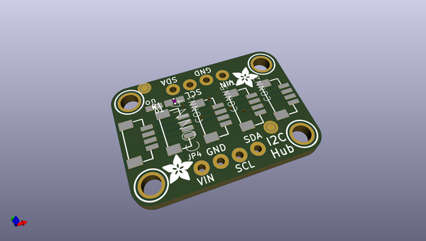
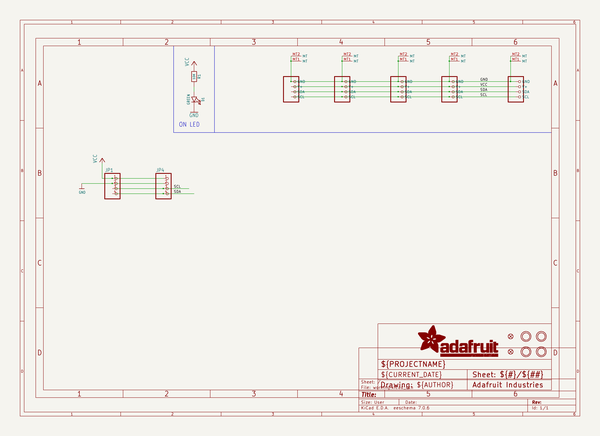
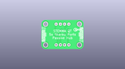
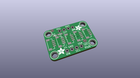
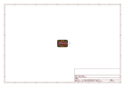
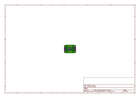
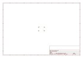
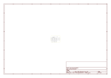

# OOMP Project  
## Adafruit-Qwiic-Stemma-QT-5-Port-Hub-PCB  by adafruit  
  
(snippet of original readme)  
  
-- Adafruit Qwiic / Stemma QT 5 Port Hub PCB  
  
<a href="http://www.adafruit.com/products/5625">   
Click here to purchase one from the Adafruit shop</a>  
  
PCB files for the Adafruit Qwiic / Stemma QT 5 Port Hub.   
  
Format is EagleCAD schematic and board layout  
* https://www.adafruit.com/product/5625  
  
--- Description  
  
Qwiic, or STEMMA QT, is a very efficient way to quickly prototype an idea, but a lot of Qwiic/Stemma QT driver boards only have one port, and devices have two ports but that's only good for chaining. Maybe you want to reduce your I2C line capacitance by having a star formation instead of a looooong chain. Or maybe its just easier for your mechanical layout to have them closer to a central point.   
  
This 5-Port Passive Hub board has 5 vertical JST SH 1mm connectors in a row, all with the power, ground and SDA/SCL pins connected. There's also breadboard breakout pins if you need. Use this hub to add as many I2C devices to the bus as you need. Complete with mounting holes so the board can be added to any system. A small power LED lets you know that the hub board has connectivity.  
  
Please note: this is a 'passive' hub, so it isn't like you can connect 5 of the same-address-sensor-boards and have them individually work. It's only a mechanical assistant for connecting many QT/Qwiic boards together.  
  
Simply plug and go. No soldering required, but comes with a bit of header if you prefer breadboarding.  
  
--- License  
  
Adaf  
  full source readme at [readme_src.md](readme_src.md)  
  
source repo at: [https://github.com/adafruit/Adafruit-Qwiic-Stemma-QT-5-Port-Hub-PCB](https://github.com/adafruit/Adafruit-Qwiic-Stemma-QT-5-Port-Hub-PCB)  
## Board  
  
  
## Schematic  
  
  
  
[schematic pdf](working_schematic.pdf)  
## Images  
  
  
  
  
  
  
  
  
  
  
  
  
  
  
  
  
