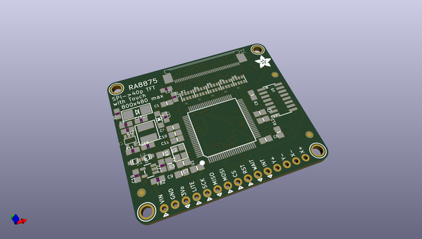
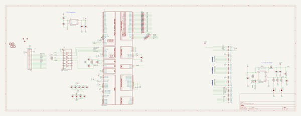
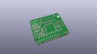
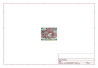
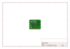
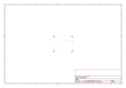
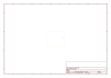
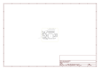

# OOMP Project  
## Adafruit-RA8875-Breakout-Board-PCB  by adafruit  
  
(snippet of original readme)  
  
-- Adafruit RA8875 Driver Board for 40-pin TFT Touch Displays - 800x480 Max PCB  
  
<a href="http://www.adafruit.com/products/1590">   
Click here to purchase one from the Adafruit shop</a>  
  
PCB files for the Adafruit RA8875 Driver Board for 40-pin TFT Touch Displays - 800x480 Max. Format is EagleCAD schematic and board layout  
* https://www.adafruit.com/product/1590  
  
--- Description  
  
Have you gazed longingly at large TFT displays - you know what I'm talking about here, 4", 5" or 7" TFTs with up to 800x480 pixels. Then you look at your Arduino. You love your Arduino (you really do!) but there's no way it can control a display like that, one that requires 60Hz refresh and 4 MHz pixel clocking. Heck, it doesn't even have enough pins. I suppose you could move to ARM core processors with TTL display drivers built in but you've already got all these shields working and anyways you like small micros you've got.  
  
What if I told you there was a driver chip that could fulfill those longings? A chip that can control up 800x480 displays, and heck, a resistive touchscreen as well. All you need to give up is 5 or so SPI pins. Would you even believe me? Well, sit down because this product may shock you.  
  
The RA8875 is a powerful TFT driver chip. It is a perfect match for any chip that wants to draw on a big TFT screen but doesn't quite have the oomph (whether it be hardware or speed). Inside is 768KB of RAM, so it can buffer the display (and   
  full source readme at [readme_src.md](readme_src.md)  
  
source repo at: [https://github.com/adafruit/Adafruit-RA8875-Breakout-Board-PCB](https://github.com/adafruit/Adafruit-RA8875-Breakout-Board-PCB)  
## Board  
  
  
## Schematic  
  
  
  
[schematic pdf](working_schematic.pdf)  
## Images  
  
  
  
  
  
  
  
  
  
  
  
  
  
  
  
  
