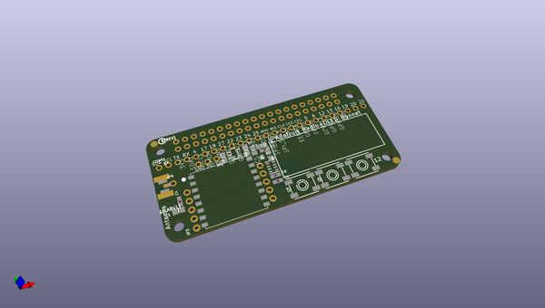
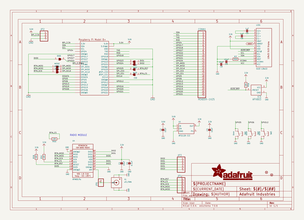
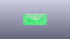
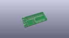
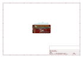
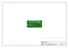
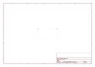
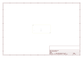
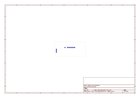
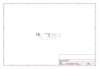

# OOMP Project  
## Adafruit-Radio-Bonnet-PCB  by adafruit  
  
oomp key: oomp_projects_flat_adafruit_adafruit_radio_bonnet_pcb  
(snippet of original readme)  
  
-- Adafruit LoRa Radio Bonnet with OLED - RFM95W @ 915MHz - RadioFruit PCB  
  
<a href="http://www.adafruit.com/products/4074">   
Click here to purchase one from the Adafruit shop</a>  
  
PCB files for the Adafruit LoRa Radio Bonnet with OLED - RFM95W @ 915MHz - RadioFruit. Format is EagleCAD schematic and board layout  
* https://www.adafruit.com/product/4074  
  
--- Description  
  
The latest Raspberry Pi computers come with WiFi and Bluetooth, and now you can add even more radio options with the Adafruit Radio Bonnets! Upgrade your Raspberry Pi with a LoRa / LoRaWAN radio, so it can communicate over very long distances. These bonnets plug right into your Pi and give you long range wireless capabilities to remote nodes that may be battery powered. Or, you can create Internet gateways with ease.  
  
You not only get a radio module, but also a 128x32 OLED display for status messages and three buttons you can use for creating a custom user interface or sending test messages. All of the above is supported with our Python libraries so you can send or receive LoRa data with other matching modules, send data to a LoRaWAN gateway, or even set up your own single channel LoRaWAN-to-Internet gateways.  
  
Compared to the 2.4 GHz WiFi/Bluetooth radios on the Pi already, these modules run at 433 or 900 MHz (sub-GHz). You can't send data as fast but you can send data a lot farther. These packet radios are simpler than WiFi or BLE, you don't have to associ  
  full source readme at [readme_src.md](readme_src.md)  
  
source repo at: [https://github.com/adafruit/Adafruit-Radio-Bonnet-PCB](https://github.com/adafruit/Adafruit-Radio-Bonnet-PCB)  
## Board  
  
  
## Schematic  
  
  
  
[schematic pdf](working_schematic.pdf)  
## Images  
  
  
  
  
  
  
  
  
  
  
  
  
  
  
  
  
