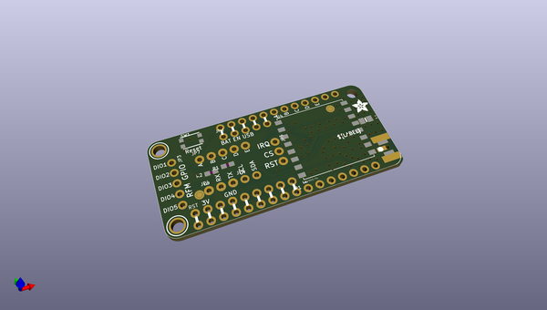
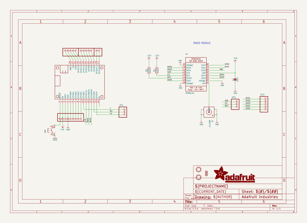
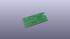
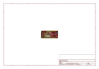
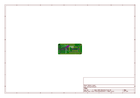
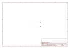
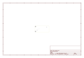
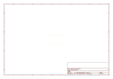
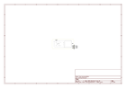

# OOMP Project  
## Adafruit-Radio-FeatherWing-PCB  by adafruit  
  
oomp key: oomp_projects_flat_adafruit_adafruit_radio_featherwing_pcb  
(snippet of original readme)  
  
-- Adafruit Radio FeatherWings PCB  
<a href="http://www.adafruit.com/products/3229">   
Click here to purchase one from the Adafruit shop</a>  
  
Add short-hop wireless to your Feather with these RadioFruit Featherwings. These add-ons for any Feather board will let you integrate packetized radio (with the RFM69 radio) or LoRa radio (with the RFM9x's). These radios are good options for kilometer-range radio, and paired with one of our WiFi, cellular or Bluetooth Feathers, will let you bridge from 433/900 MHz to the Internet or your mobile device.  
  
These radio modules come in four variants (two modulation types and two frequencies) The RFM69's are easiest to work with, and are well known and understood. The LoRa radios are exciting, longer-range and more powerful but also more expensive.  
  
- [RFM69 @ 433 MHz](https://www.adafruit.com/products/3230) - basic packetized FSK/GFSK/MSK/GMSK/OOK radio at 433 MHz for use in Europe ITU 1 license-free ISM, or for amateur use with restrictions (check your local  amateur regulations!)  
- [RFM69 @ 900 MHz](https://www.adafruit.com/products/3229) - basic packetized FSK/GFSK/MSK/GMSK/OOK radio at 868 or 915 MHz for use in Americas ITU 2 license-free ISM, or for amateur use with restrictions (check your amateur regulations!)  
- [RFM98 @ 433 MHz](https://www.adafruit.com/products/3232) - LoRa capable radio at 433 MHz for use in Europe ITU 1 license-free ISM, or for amateur use with restrictions (c  
  full source readme at [readme_src.md](readme_src.md)  
  
source repo at: [https://github.com/adafruit/Adafruit-Radio-FeatherWing-PCB](https://github.com/adafruit/Adafruit-Radio-FeatherWing-PCB)  
## Board  
  
  
## Schematic  
  
  
  
[schematic pdf](working_schematic.pdf)  
## Images  
  
  
  
  
  
  
  
  
  
  
  
  
  
  
  
  
