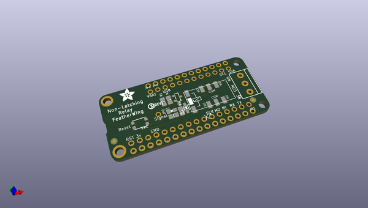
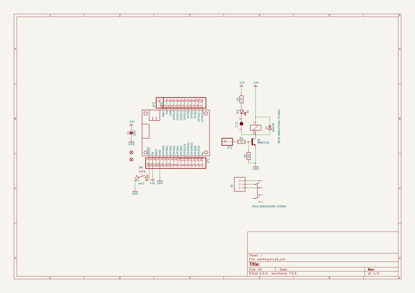
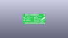
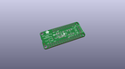
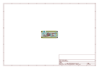
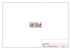
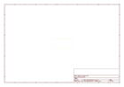
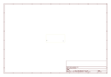
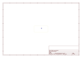
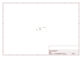

# OOMP Project  
## Adafruit-Relay-FeatherWing-PCBs  by adafruit  
  
oomp key: oomp_projects_flat_adafruit_adafruit_relay_featherwing_pcbs  
(snippet of original readme)  
  
-- Adafruit Relay FeatherWing PCBs  
&nbsp;    
Click to purchase from the Adafruit Shop:  
- [Latching Mini Relay FeatherWing](https://www.adafruit.com/product/2923)  
- [Non-Latching Mini Relay FeatherWing](https://www.adafruit.com/product/2895)  
  
The are two 'flavors' of these FeatherWings, one is the Latching relay, requires two pins, a SET and UNSET and instead of keeping the SET pin high, you only have to pulse each pin high for 10ms to latch the relay open or closed. You need two pins but save power. Note, if power is lost, the relay will stay in the last setting.  
  
The other type of relay FeatherWing is the simple Non-Latching relay, it requires only a single signal pin.  
  
Both FeatherWings use the same family of relay. You can switch up to 2A of resistive current at 30VDC or ~40VAC or lower. At 110VDC you can switch up to 0.3A, at 120VAC up to 0.5A, and at 250VAC you can switch up to 0.6A. Check the datasheet for the relay for the exact switching capacity, and of course, for reactive/inductive loads you will need to derate. This isn't a relay you can use to turn on and off your washer/dryer, stick to 60W or less. For up to 1200W devices, check out our Power Featherwing which can handle up to 10A!  
  
For more details, check out the product pages at  
- https://www.adafruit.com/  
  full source readme at [readme_src.md](readme_src.md)  
  
source repo at: [https://github.com/adafruit/Adafruit-Relay-FeatherWing-PCBs](https://github.com/adafruit/Adafruit-Relay-FeatherWing-PCBs)  
## Board  
  
  
## Schematic  
  
  
  
[schematic pdf](working_schematic.pdf)  
## Images  
  
  
  
  
  
  
  
  
  
  
  
  
  
  
  
  
