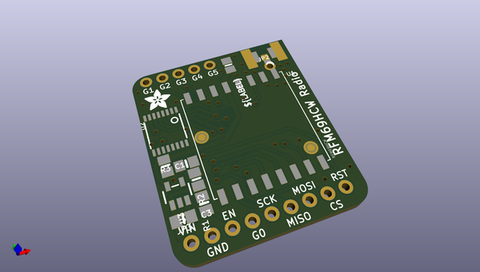
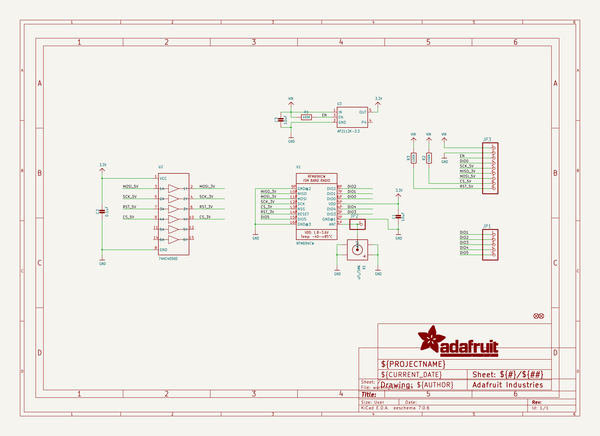
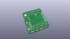
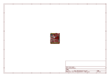
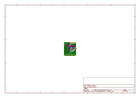
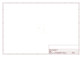
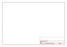
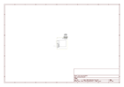

# OOMP Project  
## Adafruit-RFM-LoRa-Radio-Breakout-PCB  by adafruit  
  
(snippet of original readme)  
  
-- Adafruit RFM LoRa Radio Breakout PCB  
<a href="http://www.adafruit.com/products/3070">   
Click here to purchase one from the Adafruit shop</a>  
  
"You see, wire telegraph is a kind of a very, very long cat.  You pull his tail in New York and his head is meowing in Los Angeles.  Do you understand this? And radio operates exactly the same way: you send signals here, they receive them there.  The only difference is that there is no cat."  
  
Sending data over long distances is like magic, and now you can be a magician with this range of powerful and easy-to-use radio modules. Sure, sometimes you want to talk to a computer (a good time to use WiFi) or perhaps communicate with a Phone (choose Bluetooth Low Energy!) but what if you want to send data very far? Most WiFi, Bluetooth, Zigbee and other wireless chipsets use 2.4GHz, which is great for high speed transfers. If you aren't so concerned about streaming a video, you can use a lower license-free frequency such as 433 or 900 MHz. You can't send data as fast but you can send data a lot farther.'  
  
Also, these packet radios are simpler than WiFi or BLE, you dont have to associate, pair, scan, or worry about connections. All you do is send data whenever you like, and any other modules tuned to that same frequency (and, with the same encryption key) will receive. The receiver can then send a reply back. The modules do packetization, error correction and can also auto-retransmit so i  
  full source readme at [readme_src.md](readme_src.md)  
  
source repo at: [https://github.com/adafruit/Adafruit-RFM-LoRa-Radio-Breakout-PCB](https://github.com/adafruit/Adafruit-RFM-LoRa-Radio-Breakout-PCB)  
## Board  
  
  
## Schematic  
  
  
  
[schematic pdf](working_schematic.pdf)  
## Images  
  
  
  
  
  
  
  
  
  
  
  
  
  
  
  
  
