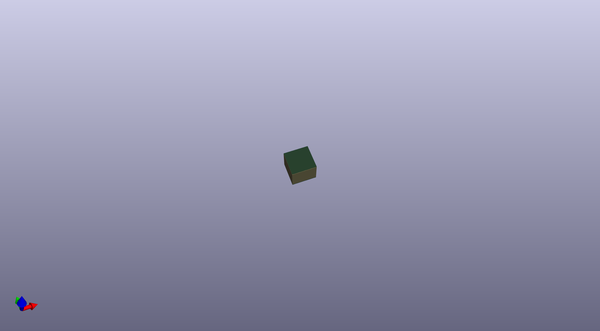

# OOMP Project  
## Adafruit-RGB-LCD-shield-PCB  by adafruit  
  
(snippet of original readme)  
  
- RGB LCD Shield Kit  
  
  
  
This new Adafruit shield makes it easy to use a 16x2 Character LCD. We really like the RGB LCDs we stock in the shop both the [RGB negative](http://www.adafruit.com/products/399) and [RGB positive](http://www.adafruit.com/products/398). Unfortunately, these LCDs do require quite a few digital pins, 6 to control the LCD and then another 3 to control the RGB backlight for a total of 9 pins. That's half of the pins available on a classic Arduino!  
  
With this in mind, we wanted to make it easier for people to get these LCD into their projects so we devised a shield that lets you control __a 16x2 Character LCD, up to 3 backlight pins AND 5 keypad pins using only the two I2C pins on the Arduino!__ The best part is you don't really lose those two pins either, since you can stick i2c-based sensors, RTCs, etc and have them share the I2C bus. This is a super slick way to add a display without all the wiring hassle.  
  
This shield is perfect for when you want to build a stand-alone project with its own user interface. The 4 directional buttons plus select button allows basic control without having to attach a bulky computer.  
  
The shield is designed for 'classic' Arduinos such as the Uno, Duemilanove, Diecimilla, etc. It uses the I2C pins at Analog 4 and Analog 5. It will also work perfectly with Arduino Mega R3's which have the extra SDA/SCL I2C pins broken out. Ear  
  full source readme at [readme_src.md](readme_src.md)  
  
source repo at: [https://github.com/adafruit/Adafruit-RGB-LCD-shield-PCB](https://github.com/adafruit/Adafruit-RGB-LCD-shield-PCB)  
## Board  
  
  
## Schematic  
  
  
  
[schematic pdf](working_schematic.pdf)  
## Images  
  
  
  
  
  
  
  
  
  
  
  
  
  
  
  
  
