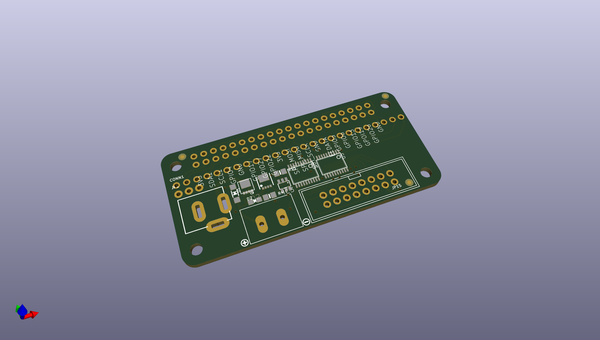
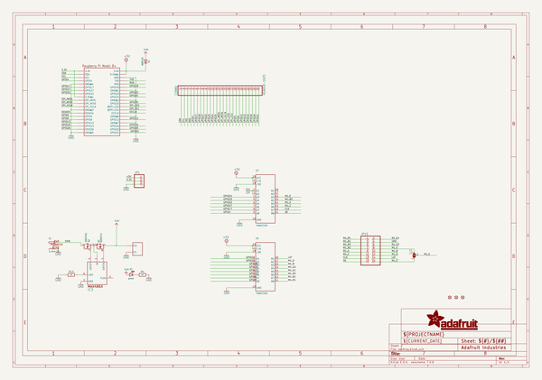
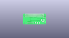
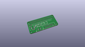
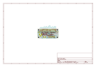
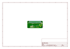
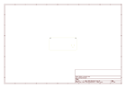
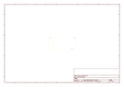
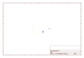
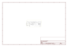

# OOMP Project  
## Adafruit-RGB-Matrix-Bonnet-PCB  by adafruit  
  
(snippet of original readme)  
  
-- Adafruit RGB LED Matrix Display Bonnet PCB  
  
<a href="http://www.adafruit.com/products/3211">   
Click here to purchase one from the Adafruit shop</a>  
  
PCB files for the Adafruit RGB Matrix Bonnet. Format is EagleCAD schematic and board layout  
  
For more details, check out the product page at  
* https://www.adafruit.com/product/3211  
  
--- Description  
  
You can now create a dazzling display with your Raspberry Pi with the Adafruit RGB Matrix Bonnet. These boards plug into your Pi and makes it super easy to control RGB matrices such as those we stock in the shop and create a colorful scrolling display or mini LED wall with ease.  
  
"Bonnet" boards work on any Raspberry Pi with a 40-pin GPIO header — Zero, Zero W/WH, Model A+, B+, Pi 2 and Pi 3. They do not work with older 26-pin boards like the original Model A or B. Note with the Pi Zero you may need to solder a header on the Pi board; it’s normally unpopulated on that model.  
  
We also have an older, HAT version of our RGB Matrix design. The HAT version does not come fully assembled, does not support 1/32-scan matrices, but does come with a real time clock (RTC)  
  
This bonnet will make your matrix projects super easy and avoids wiring complexity.  
  
Please note: this Bonnet is only for use with HUB75 type RGB matrices. Not for use with NeoPixel, DotStar, or other 'addressable' LEDs.  
  
--- License  
  
Adafruit invests time and resources providing this open source design, please support A  
  full source readme at [readme_src.md](readme_src.md)  
  
source repo at: [https://github.com/adafruit/Adafruit-RGB-Matrix-Bonnet-PCB](https://github.com/adafruit/Adafruit-RGB-Matrix-Bonnet-PCB)  
## Board  
  
  
## Schematic  
  
  
  
[schematic pdf](working_schematic.pdf)  
## Images  
  
  
  
  
  
  
  
  
  
  
  
  
  
  
  
  
