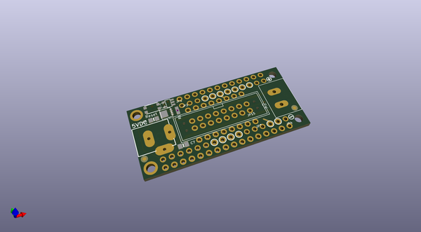
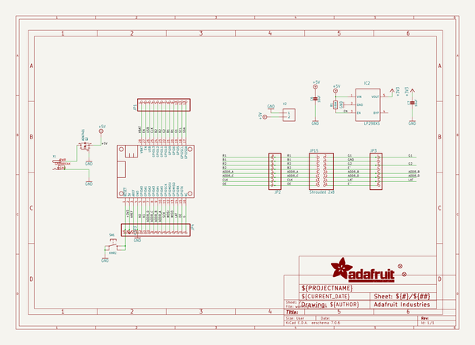
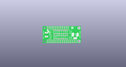
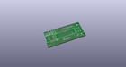
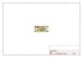
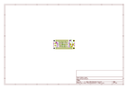
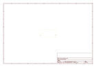
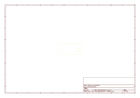
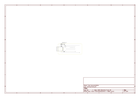

# OOMP Project  
## Adafruit-RGB-Matrix-FeatherWing-PCB  by adafruit  
  
(snippet of original readme)  
  
-- Adafruit RGB Matrix Featherwing Kit PCB - For M0 and M4 Feathers  
   
<a href="http://www.adafruit.com/products/3036">   
Click here to purchase one from the Adafruit shop</a>  
  
PCB files for the Adafruit RGB Matrix Featherwing Kit. Format is EagleCAD schematic and board layout  
* https://www.adafruit.com/product/3036  
  
--- Description  
  
Ahoy! It's time to create a dazzling light up project with our new RGB Matrix FeatherWing. Now you can quickly and easily create projects featuring your favorite 16 or 32-pixel tall matrix boards. Using our RGB Matrix library is easy and works wonderfully with any of our M0, M4 or nRF52840 Feathers.  
  
Please note: This wing is only tested/designed to work with the SAMD21 M0, SAMD51 M4 and nRF52840 Feathers. It's not for use with any other Feathers at this time. (That said, if you'd like to add support, [we'd be happy to take a pull request](https://github.com/adafruit/RGB-matrix-Panel) on the library repo)  
  
This wing can be assembled in one of two ways. You can either solder in a 2x8 IDC shrouded header on the top, then plug in the IDC cable that came with your matrix. This makes it easy to stack on top of your Feather. Or, you can solder in the 2x10 socket header on the bottom of the Wing, and then stack your Feather on top. That way you can plug it directly into the back of the matrix *mind  
  full source readme at [readme_src.md](readme_src.md)  
  
source repo at: [https://github.com/adafruit/Adafruit-RGB-Matrix-FeatherWing-PCB](https://github.com/adafruit/Adafruit-RGB-Matrix-FeatherWing-PCB)  
## Board  
  
  
## Schematic  
  
  
  
[schematic pdf](working_schematic.pdf)  
## Images  
  
  
  
  
  
  
  
  
  
  
  
  
  
  
  
  
