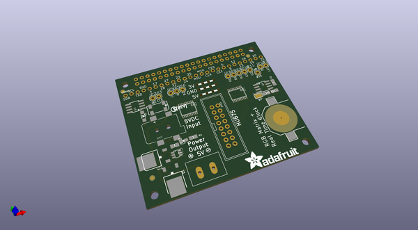
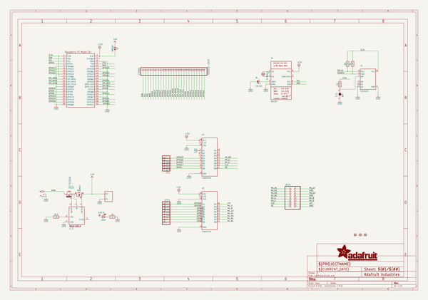
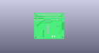
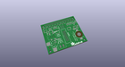
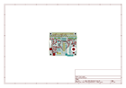
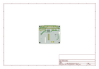
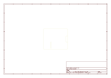
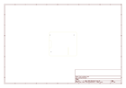
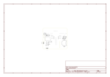

# OOMP Project  
## Adafruit-RGB-Matrix-HAT-PCB  by adafruit  
  
oomp key: oomp_projects_flat_adafruit_adafruit_rgb_matrix_hat_pcb  
(snippet of original readme)  
  
-- Adafruit RGB Matrix HAT PCB  
  
<a href="http://www.adafruit.com/products/1932">   
Click here to purchase one from the Adafruit shop</a>  
  
PCB files for the Adafruit RGB Matrix HAT. Format is EagleCAD schematic and board layout  
* https://www.adafruit.com/product/2345  
  
--- DESCRIPTION  
You can now create a dazzling display with your Raspberry Pi Model Zero/A+/B+/Pi 2 or Pi 3 with the Adafruit RGB Matrix HAT. This HAT plugs into your Pi and makes it super easy to control RGB matrices such as those we stock in the shop and create a colorful scrolling display or mini LED wall with ease.  
  
This HAT is our finest to date, full of some really great circuitry. Let me break it down for you:  
  
Simple design - plug in power, plug in IDC cable, run our Python code!  
Power protection circuitry - you can plug a 5V 4A wall adapter into the HAT and it will automatically protect against negative, over or under-voltages! Yay for no accidental destruction of your setup.  
Onboard level shifters to convert the RasPi's 3.3V to 5.0V logic for clean and glitch free matrix driving  
DS1307 Real Time Clock can keep track of time for the Pi even when it is rebooted or powered down, to make for really nice time displays  
Works with any of our 16x32, 32x32, 32x64 or 64x64 RGB LED Matrices with HUB75 connections. You can even chain multiple matrices together for a longer display, you can chain as many as you like but the bigger the display the harder it is on t  
  full source readme at [readme_src.md](readme_src.md)  
  
source repo at: [https://github.com/adafruit/Adafruit-RGB-Matrix-HAT-PCB](https://github.com/adafruit/Adafruit-RGB-Matrix-HAT-PCB)  
## Board  
  
  
## Schematic  
  
  
  
[schematic pdf](working_schematic.pdf)  
## Images  
  
  
  
  
  
  
  
  
  
  
  
  
  
  
  
  
