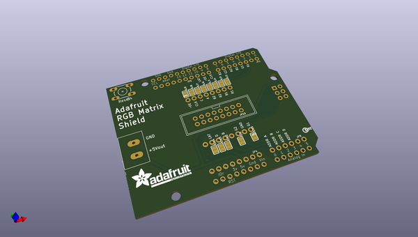
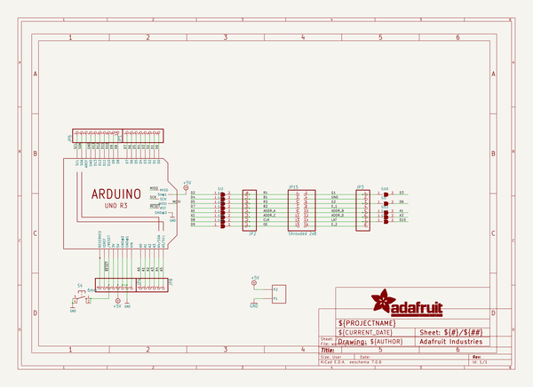
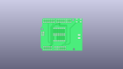
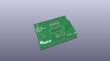
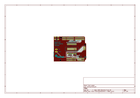
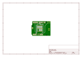
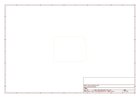
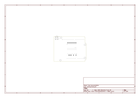

# OOMP Project  
## Adafruit-RGB-Matrix-Shield-PCB  by adafruit  
  
(snippet of original readme)  
  
-- Adafruit RGB Matrix Display Shield PCB  
  
<a href="http://www.adafruit.com/products/2601">   
Click here to purchase one from the Adafruit shop</a>  
  
PCB files for the Adafruit RGB Matrix Shield. PCB format is EagleCAD schematic and board layout  
  
For more details, check out the product page at  
* https://www.adafruit.com/product/2601  
  
--- Description  
  
Our RGB matricies are dazzling, with their hundreds or even thousands of individual RGB LEDs. Compared to NeoPixels, they've got great density, power usage and the price-per-LED can't be beat. But...(isn't there always a but?) You need to use our special library to control them and they require a bunch of wires to be plugged in. Tougher than a single-wire connection for sure.  
  
If you've got an Arduino-compatible board, with an ATmega328p chip (like our Metro 328) or SAMD21 (like the Metro M0) or even SAMD51 (like our Metro M4) this shield will make usage a snap! A little light soldering to attach the headers, connector and terminal block and you're ready to rock. Plug it onto your microcontroller board, and you'll be able to attach any RGB matrix with ease. This shield just takes care of the wiring for you!  
  
For 800mA or less power usage on the matrix you can even 'borrow' the 5V power from the Arduino's regulator. This isn't good for projects where you have a lot of LEDs on at once but for scrolling text and light LED usage it will make wiring even easier because you dont need  
  full source readme at [readme_src.md](readme_src.md)  
  
source repo at: [https://github.com/adafruit/Adafruit-RGB-Matrix-Shield-PCB](https://github.com/adafruit/Adafruit-RGB-Matrix-Shield-PCB)  
## Board  
  
  
## Schematic  
  
  
  
[schematic pdf](working_schematic.pdf)  
## Images  
  
  
  
  
  
  
  
  
  
  
  
  
  
  
  
  
