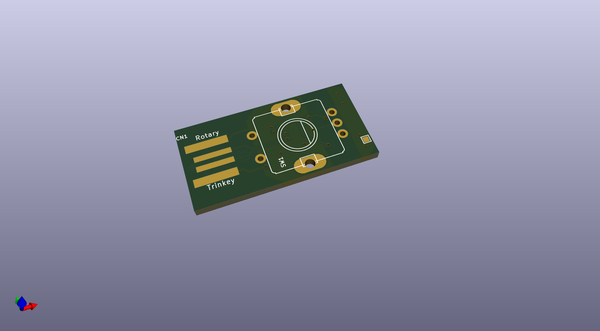
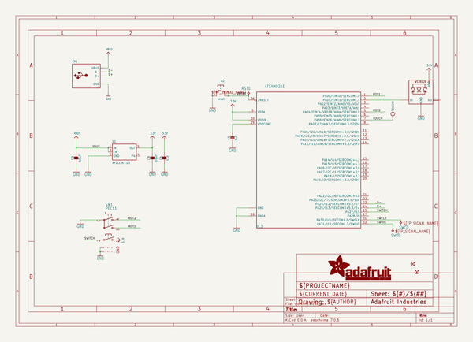
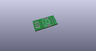
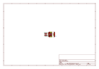
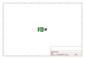
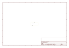
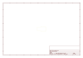
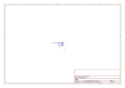

# OOMP Project  
## Adafruit-Rotary-Trinkey-PCB  by adafruit  
  
oomp key: oomp_projects_flat_adafruit_adafruit_rotary_trinkey_pcb  
(snippet of original readme)  
  
-- Adafruit Rotary Trinkey PCB  
  
<a href="http://www.adafruit.com/products/4964">   
Click here to purchase one from the Adafruit shop</a>  
  
PCB files for the Adafruit Rotary Trinkey.   
  
Format is EagleCAD schematic and board layout  
* https://www.adafruit.com/product/4964  
  
--- Description  
  
It's half USB Key, half Adafruit Trinket, half rotary encoder...it's Rotary Trinkey, the circuit board with a Trinket M0 heart, a NeoPixel glow, and a rotary encoder body. We were inspired by this project from TodBot where a rotary encoder was soldered onto a QT Py. So we thought, hey what if we made something like that that plugs right into your computer's USB port, with a fully programmable color NeoPixel? And this is what we came up with!  
  
The PCB is designed to slip into any USB A port on a computer or laptop. There's an ATSAMD21 microcontroller on board with just enough circuitry to keep it happy. Three pins of the microcontroller connects to a rotary encoder with built-in push switch. Another connects to a NeoPixel LED. Finally, one pin can be used as a capacitive touch input. A reset button lets you enter bootloader mode if necessary. That's it!  
  
Rotary encoders are soooo much fun! Twist em this way, then twist them that way. Unlike potentiometers, they go all the way around, and often have little detents for tactile feedback. But, if you just want to add one to your computer, you know its a real pain. This board is designed to make it  
  full source readme at [readme_src.md](readme_src.md)  
  
source repo at: [https://github.com/adafruit/Adafruit-Rotary-Trinkey-PCB](https://github.com/adafruit/Adafruit-Rotary-Trinkey-PCB)  
## Board  
  
  
## Schematic  
  
  
  
[schematic pdf](working_schematic.pdf)  
## Images  
  
  
  
  
  
  
  
  
  
  
  
  
  
  
  
  
