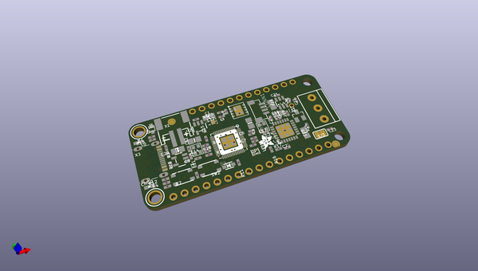

# OOMP Project  
## Adafruit-RP2040-CAN-Bus-Feather-PCB  by adafruit  
  
(snippet of original readme)  
  
-- Adafruit RP2040 CAN Bus Feather with MCP2515 CAN Controller - STEMMA QT PCB  
  
<a href="http://www.adafruit.com/products/5724">   
Click here to purchase one from the Adafruit shop</a>  
  
PCB files for the Adafruit RP2040 CAN Bus Feather with MCP2515 CAN Controller - STEMMA QT.   
  
Format is EagleCAD schematic and board layout  
* https://www.adafruit.com/product/5724  
  
--- Description  
  
If you'd like to quickly get started with CAN bus interfacing, with no soldering required, our Adafruit RP2040 CAN Bus Feather comes ready-to-rock with a microcontroller, CAN chipset and terminal blocks for instant gratification. The controller used is the MCP26525 (aka a MCP2515 with built-in transciever), an extremely popular and well-supported chipset that has drivers in Arduino and CircuitPython and only requires an SPI port and two pins for chip-select and IRQ. Use it to send and receive messages in either standard or extended format at up to 1 Mbps.  
  
Feather is the development board specification from Adafruit, and like its namesake, it is thin, light, and lets you fly! We designed Feather to be a new standard for portable microcontroller cores. We have other boards in the Feather family, check'em out here.  
  
CAN Bus is a small-scale networking standard, originally designed for cars and, yes, busses, but is now used for many robotics or sensor networks that need better range and addressing than I2C and don't have the pins or computational abil  
  full source readme at [readme_src.md](readme_src.md)  
  
source repo at: [https://github.com/adafruit/Adafruit-RP2040-CAN-Bus-Feather-PCB](https://github.com/adafruit/Adafruit-RP2040-CAN-Bus-Feather-PCB)  
## Board  
  
  
## Schematic  
  
  
  
[schematic pdf](working_schematic.pdf)  
## Images  
