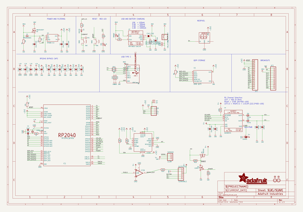

# OOMP Project  
## Adafruit-RP2040-Prop-Maker-Feather-PCB  by adafruit  
  
(snippet of original readme)  
  
-- Adafruit RP2040 Prop-Maker Feather with I2S Audio Amplifier PCB  
  
<a href="http://www.adafruit.com/products/5768">   
Click here to purchase one from the Adafruit shop</a>  
  
PCB files for the Adafruit RP2040 Prop-Maker Feather with I2S Audio Amplifier.   
  
Format is EagleCAD schematic and board layout  
* https://www.adafruit.com/product/5768  
  
--- Description  
  
The Adafruit Feather series gives you lots of options for a small, portable, rechargeable microcontroller board. By picking a feather and stacking on a FeatherWing you can create advanced projects quickly. One popular combo is our Feather M4 or Feather RP2040 with a Prop-Maker FeatherWing on top to create animatronics or props that boot up instantly and can drive LEDs, and small speakers.  
  
We've used the Prop-Maker FeatherWing to make lots of lil robots, swords, and other prop projects. However, what if we made it even easier for people to make props? What if we made it so many projects can be built with minimal or no soldering at all? Yeah that would be pretty nice!  
  
Thus, the creation of the Feather P2040 Prop-Maker: an all-in-one combination of the Feather RP2040 with a Prop-Maker FeatherWing with a few tweaks based on feedback from expert prop-builders. Perfect for fitting into your next prop build! This Feather will unlock the prop-maker inside all of us, with tons of stuff packed in to make sabers & swords, props, toys, cosplay pieces, and more.  
  
We looked at hun  
  full source readme at [readme_src.md](readme_src.md)  
  
source repo at: [https://github.com/adafruit/Adafruit-RP2040-Prop-Maker-Feather-PCB](https://github.com/adafruit/Adafruit-RP2040-Prop-Maker-Feather-PCB)  
## Board  
  
  
## Schematic  
  
  
  
[schematic pdf](working_schematic.pdf)  
## Images  
  
  
  
  
  
  
  
  
  
  
  
  
  
  
  
  
