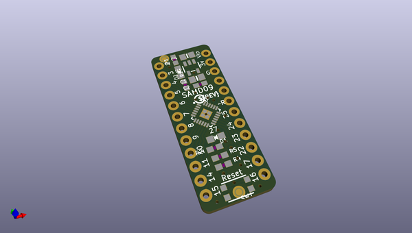
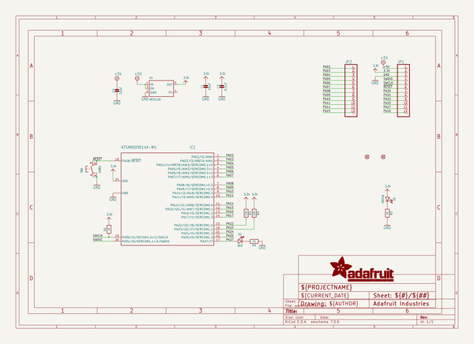
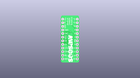
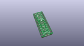
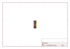
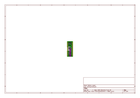
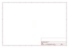
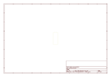
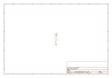

# OOMP Project  
## Adafruit-SAMD09-Breakout-PCB  by adafruit  
  
(snippet of original readme)  
  
-- Adafruit SAMD09 Breakout PCB  
  
<a href="http://www.adafruit.com/products/3657">   
Click here to purchase one from the Adafruit shop</a>  
  
PCB files for the Adafruit SAMD09 microcontroller breakout  
  
Format is EagleCAD schematic and board layout  
  
For more details, check out the product page at  
* https://www.adafruit.com/products/3657  
  
--- Description  
  
Adafruit seesaw is a near-universal converter framework which allows you to add add and extend hardware support to any I2C-capable microcontroller or microcomputer. Instead of getting separate I2C GPIO expanders, ADCs, PWM drivers, etc, seesaw can be configured to give a wide range of capabilities.  
  
For example, our ATSAMD09 breakout with seesaw gives you  
  
* 3 x 12-bit ADC inputs  
* 3 x 8-bit PWM outputs  
* 7 x GPIO with selectable pullup or pulldown  
* 1 x NeoPixel output (up to 340 pixels)  
* 1 x EEPROM with 64 byte of NVM memory (handy for storing small access tokens or MAC addresses)  
* 1 x Interrupt output that can be triggered by any of the accessories  
* 2 x I2C address selection pins  
* 1 x Activity LED  
  
But you can reprogram and reconfigure the chip to have more or less of each peripheral - as long as it fits into the ATSAMD09D14's firmware! For example, there's also a UART converter but it isn't included in the default firmware.  
  
The ATSAMD09 breakout is great for development of seesaw capabilities (we use it in-house for our design work) or you can use it as-is to give you  
  full source readme at [readme_src.md](readme_src.md)  
  
source repo at: [https://github.com/adafruit/Adafruit-SAMD09-Breakout-PCB](https://github.com/adafruit/Adafruit-SAMD09-Breakout-PCB)  
## Board  
  
  
## Schematic  
  
  
  
[schematic pdf](working_schematic.pdf)  
## Images  
  
  
  
  
  
  
  
  
  
  
  
  
  
  
  
  
