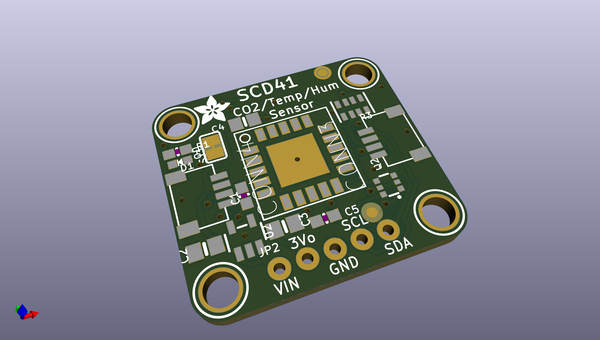
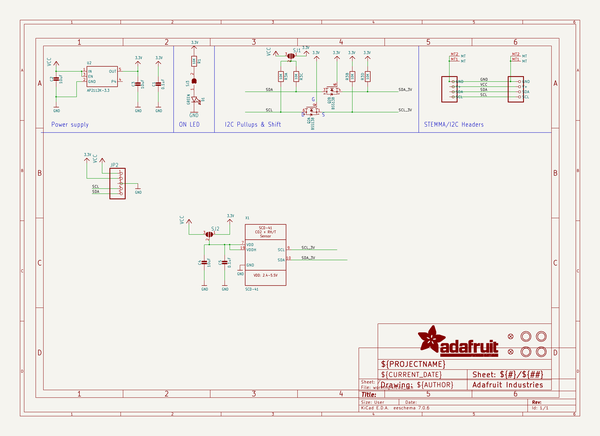
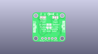
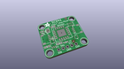
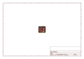
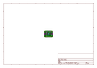
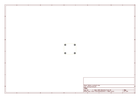
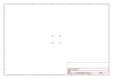
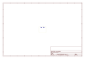
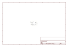

# OOMP Project  
## Adafruit-SCD-4x-PCB  by adafruit  
  
oomp key: oomp_projects_flat_adafruit_adafruit_scd_4x_pcb  
(snippet of original readme)  
  
-- Adafruit SCD-4x CO2, Temperature and Humidity Sensor PCB  
  
   
   
Click above to purchase one from the Adafruit shop!  
  
PCB files for the Adafruit SCD-4x CO2, Temperature and Humidity Sensor.   
  
Format is EagleCAD schematic and board layout  
* https://www.adafruit.com/product/5190  
  
--- Description  
  
Take a deep breath in...now slowly breathe out. Mmm isn't it wonderful? All that air around us, which we bring into our lungs, extracts oxygen from and then breathes out carbon dioxide. CO2 is essential for life on this planet we call Earth - we and plants take turns using and emitting CO2 in an elegant symbiosis. But it's important to keep that CO2 balanced - you don't want too much around, not good for humans and not good for our planet.  
  
The SCD-40 is a photoacoustic 'true' CO2 sensor that will tell you the CO2 PPM (parts-per-million) composition of ambient air. Unlike the SGP30, this sensor isn't approximating it from VOC gas concentration - it really is measuring the CO2 concentration! That means it's bigger and more expensive, but it is the real thing. Perfect for environmental sensing, scientific experiments, air quality and ventilation studies, and more.  
  
Compared to the illustrious SCD-30, this sensor uses a different measurement technique, which allows it to be much s  
  full source readme at [readme_src.md](readme_src.md)  
  
source repo at: [https://github.com/adafruit/Adafruit-SCD-4x-PCB](https://github.com/adafruit/Adafruit-SCD-4x-PCB)  
## Board  
  
  
## Schematic  
  
  
  
[schematic pdf](working_schematic.pdf)  
## Images  
  
  
  
  
  
  
  
  
  
  
  
  
  
  
  
  
