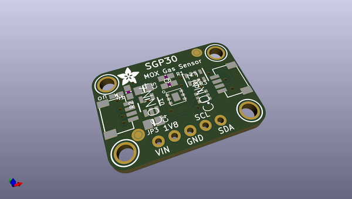
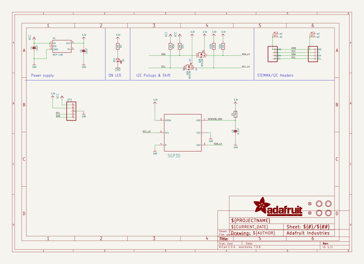
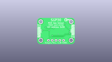
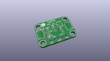
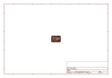
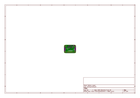
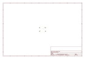
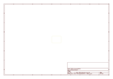
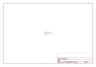

# OOMP Project  
## Adafruit-SGP30-PCB  by adafruit  
  
oomp key: oomp_projects_flat_adafruit_adafruit_sgp30_pcb  
(snippet of original readme)  
  
-- Adafruit SGP30 Air Quality Sensor PCB  
  
<a href="http://www.adafruit.com/products/3709">   
<a href="http://www.adafruit.com/products/3709">   
Click here to purchase one from the Adafruit shop</a>  
  
PCB files for the Adafruit SGP30 Air Quality Sensor.   
  
Format is EagleCAD schematic and board layout  
* https://www.adafruit.com/product/3709  
  
--- Description  
  
Breathe easy with the SGP30 Multi-Pixel Gas Sensor, a fully integrated MOX gas sensor. This is a very fine air quality sensor from the sensor experts at Sensirion, with I2C interfacing and fully calibrated output signals with a typical accuracy of 15% within measured values. The SGP combines multiple metal-oxide sensing elements on one chip to provide more detailed air quality signals.  
  
This is a gas sensor that can detect a wide range of Volatile Organic Compounds (VOCs) and H2 and is intended for indoor air quality monitoring. When connected to your microcontroller (running our library code) it will return a Total Volatile Organic Compound (TVOC) reading and an equivalent carbon dioxide reading (eCO2) over I2C.  
  
The SGP30 has a 'standard' hot-plate MOX sensor, as well as a small microcontroller that controls power to the plate, reads the analog voltage, tracks the baseline calibration, calculates TVOC and eCO2 values, and provides an I2C interface to read from. Unlike the CCS811, this sensor does not require I2C  
  full source readme at [readme_src.md](readme_src.md)  
  
source repo at: [https://github.com/adafruit/Adafruit-SGP30-PCB](https://github.com/adafruit/Adafruit-SGP30-PCB)  
## Board  
  
  
## Schematic  
  
  
  
[schematic pdf](working_schematic.pdf)  
## Images  
  
  
  
  
  
  
  
  
  
  
  
  
  
  
  
  
