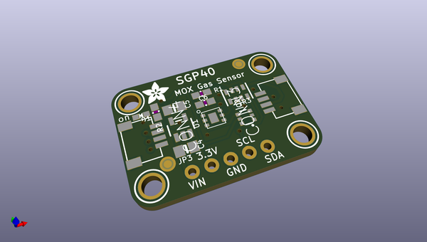
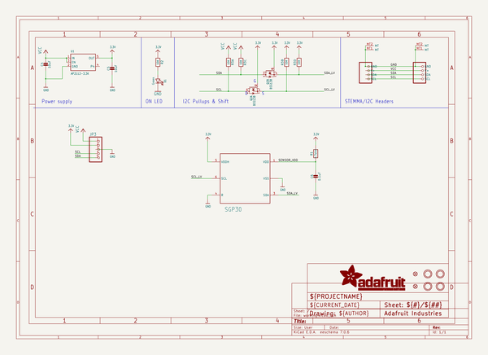
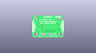
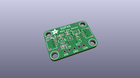
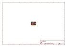
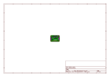
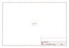

# OOMP Project  
## Adafruit-SGP40-PCB  by adafruit  
  
(snippet of original readme)  
  
-- Adafruit SGP40 Air Quality Sensor PCB  
  
<a href="http://www.adafruit.com/products/4829">   
Click here to purchase one from the Adafruit shop</a>  
  
PCB files for the Adafruit SGP40 Air Quality Sensor.  
  
Format is EagleCAD schematic and board layout  
* https://www.adafruit.com/product/4829  
  
--- Description  
  
*sniff* *sniff* ... do you smell that? No need to stick your nose into a carton of milk anymore, you can build a digital nose with the SGP40 Multi-Pixel Gas Sensor, a fully integrated MOX gas sensor. This is a very fine air quality sensor from the sensor experts at Sensirion, with I2C interfacing so you don't have to manage the heater and analog reading of a MOX sensor. It combines multiple metal-oxide sensing and heating elements on one chip to provide more detailed air quality signals.  
  
The SGP40 has a 'standard' hot-plate MOX sensor, as well as a small microcontroller that controls power to the plate, reads the analog voltage and provides an I2C interface to read from. Unlike the CCS811, this sensor does not require I2C clock stretching. We currently have an Arduino library with examples of reading the raw value and also running the Sensirion algorithm to calculate VOC index but do not have Python support (the Sensirion library is in C and requires a port)  
  
This is a gas sensor that can detect a wide range of Volatile Organic Compounds (VOCs) and H2 and is intended for indoor air quality monitoring. The SGP40 is the next  
  full source readme at [readme_src.md](readme_src.md)  
  
source repo at: [https://github.com/adafruit/Adafruit-SGP40-PCB](https://github.com/adafruit/Adafruit-SGP40-PCB)  
## Board  
  
  
## Schematic  
  
  
  
[schematic pdf](working_schematic.pdf)  
## Images  
  
  
  
  
  
  
  
  
  
  
  
  
  
  
  
  
