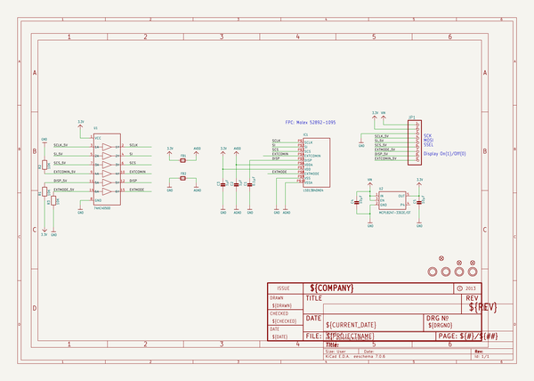

# OOMP Project  
## Adafruit-Sharp-Memory-Display-PCBs  by adafruit  
  
(snippet of original readme)  
  
- PCB for the Adafruit Sharp Memory display breakout board  
  
   
  
  
[The 96x96 resolution SHARP Memory LCD is no longer made, but we have a higher-resolution 168x144 display available in the shop](https://www.adafruit.com/product/3502).  
  
The 1.3" and 2.7" SHARP Memory LCD displays are a cross between an eInk (e-paper) display and an LCD. They have the ultra-low power usage of eInk and the fast-refresh rates of an LCD. This model has a matt silver background, and pixels show up as little mirrors for a silver-reflective display, a really beautiful and unique look. It does not have a backlight, but it is daylight readable. For dark/night reading you may need to illuminate the LCD area with external LEDs.  
  
The display is 3V powered and 3V logic, so we placed it on a fully assembled & tested breakout board with a 3V regulator and level shifting circuitry. The display slots into a ZIF socket on board and we use a piece of double-sided tape to adhere it onto one side. There are four mounting holes so you can easily attach it to a box.  
  
The display is 'write only' which means that it only needs 3 pins to send data. However, the downside of a write-only display is that the entire 96x96 bits (1,152 bytes) must be buffered by the microcontroller driver. On an Arduino Uno/Leonardo that  
  full source readme at [readme_src.md](readme_src.md)  
  
source repo at: [https://github.com/adafruit/Adafruit-Sharp-Memory-Display-PCBs](https://github.com/adafruit/Adafruit-Sharp-Memory-Display-PCBs)  
## Board  
  
  
## Schematic  
  
  
  
[schematic pdf](working_schematic.pdf)  
## Images  
  
  
  
  
  
  
  
  
  
  
  
  
  
  
  
  
