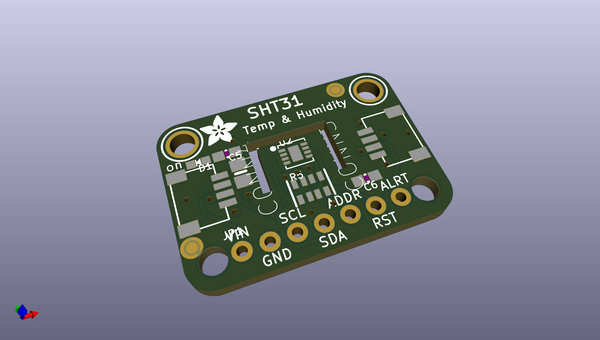
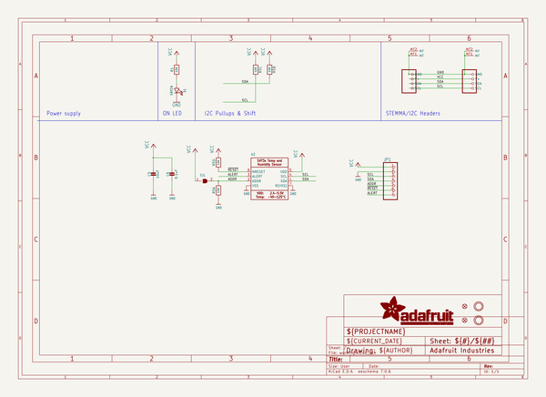
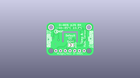
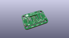
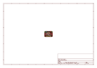
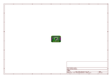
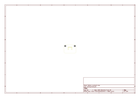
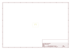
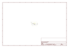

# OOMP Project  
## Adafruit-SHT31-Sensor-Breakout-PCB  by adafruit  
  
(snippet of original readme)  
  
-- Adafruit Sensirion SHT31-D - Temperature & Humidity Sensor PCB  
<a href="http://www.adafruit.com/products/2857">   
<a href="http://www.adafruit.com/products/2857">   
Click here to purchase one from the Adafruit shop</a>  
  
Sensirion Temperature/Humidity sensors are some of the finest & highest-accuracy devices you can get. And, finally we have some that have a true I2C interface for easy reading. The SHT31-D sensor has an excellent ±2% relative humidity and ±0.3°C accuracy for most uses. We now use the version with a PTFE filter, it'll stay clean while still allowing humidity measurements to work  
  
Unlike earlier SHT sensors, this sensor has a true I2C interface, and (bonus!) even with two address options. It also is 3V or 5V compliant, so you can power and communicate with it using just about any microcontroller or microcomputer.  
  
To get you going fast, we spun up a custom made PCB with the SHT31-D and some supporting circuitry such as pullup resistors and capacitors, in the STEMMA QT form factor, making them easy to interface with. The STEMMA QT connectors on either side are compatible with the SparkFun Qwiic I2C connectors. This allows you to make solderless connections between your development board and the SHT31-D or to chain them with a wide range of other sensors and accessories using a compatible cable. QT Cable is not included, but we have a variety in the shop.  
  
  full source readme at [readme_src.md](readme_src.md)  
  
source repo at: [https://github.com/adafruit/Adafruit-SHT31-Sensor-Breakout-PCB](https://github.com/adafruit/Adafruit-SHT31-Sensor-Breakout-PCB)  
## Board  
  
  
## Schematic  
  
  
  
[schematic pdf](working_schematic.pdf)  
## Images  
  
  
  
  
  
  
  
  
  
  
  
  
  
  
  
  
