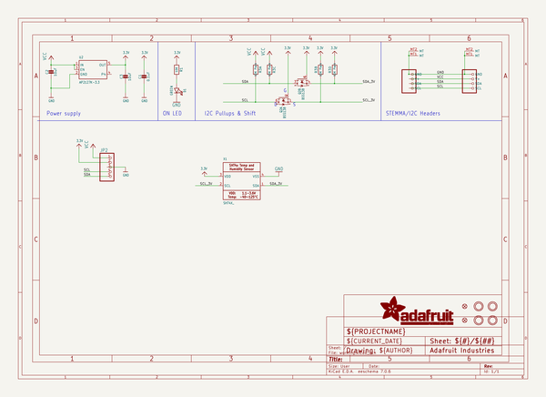
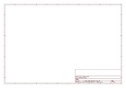

# OOMP Project  
## Adafruit-SHT40-PCB  by adafruit  
  
(snippet of original readme)  
  
-- Adafruit SHT40, SHT41, and SHT45 Temperature & Humidity Sensor PCBs  
  
<a href="http://www.adafruit.com/products/4885">   
Click here to purchase the SHT40 from the Adafruit shop</a>  
  
<a href="http://www.adafruit.com/products/5776">   
Click here to purchase the SHT41 from the Adafruit shop</a>  
  
<a href="http://www.adafruit.com/products/5665">   
Click here to purchase the SHT45 from the Adafruit shop</a>  
  
PCB files for the Adafruit SHT40, SHT41, and SHT45 Temperature & Humidity Sensors.   
  
Format is EagleCAD schematic and board layout  
* https://www.adafruit.com/product/4885  
* https://www.adafruit.com/product/5665  
* https://www.adafruit.com/product/5776  
  
--- Description  
  
  
  
Sensirion Temperature/Humidity sensors are some of the finest & highest-accuracy devices you can get. And finally, we have some that have a true I2C interface for easy reading. The SHT40, SHT41, and SHT45 sensors are the fourth generation (started at the SHT10 and worked its way up to the top!).  
  
The SHT40 has an excellent ±1.8% typical relative humidity accuracy from 25 to 75% and ±0.2 °C typical accuracy from 0 to 75 °C.  
  
The SHT41 has an excellent ±1.8% typical relative humidity accuracy from 25 to 75% and ±0.2 °C typical accuracy from 0 to 75 °C.  
  
The SHT45 has an even more excellent ±1% typical relative humidity accuracy from 25 to 75% and ±0.1 °C t  
  full source readme at [readme_src.md](readme_src.md)  
  
source repo at: [https://github.com/adafruit/Adafruit-SHT40-PCB](https://github.com/adafruit/Adafruit-SHT40-PCB)  
## Board  
  
  
## Schematic  
  
  
  
[schematic pdf](working_schematic.pdf)  
## Images  
  
  
  
  
  
  
  
  
  
  
  
  
  
  
  
  
