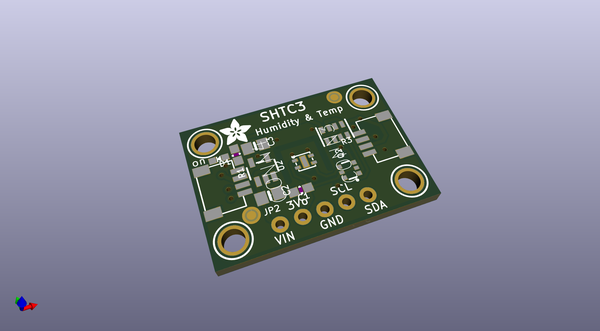
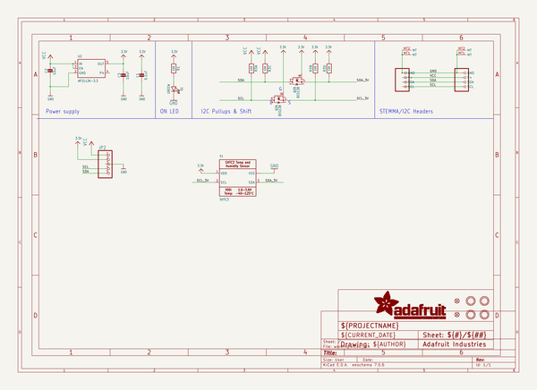
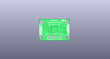
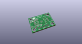
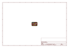
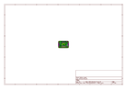
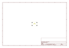
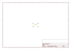
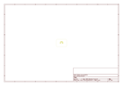
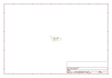

# OOMP Project  
## Adafruit-SHTC3-PCB  by adafruit  
  
(snippet of original readme)  
  
-- Adafruit Sensirion SHTC3T Temperature & Humidity Sensor PCB  
  
<a href="http://www.adafruit.com/products/4636">   
Click here to purchase one from the Adafruit shop</a>  
  
PCB files for the Adafruit Sensirion SHTC3T Temperature & Humidity Sensor.   
  
Format is EagleCAD schematic and board layout  
* https://www.adafruit.com/product/4636  
  
--- Description  
  
Sensirion Temperature/Humidity sensors are some of the finest & highest-accuracy devices you can get. And with a true I2C interface, reading the data is for easy. The SHTC3 sensor has an excellent ±2% relative humidity and ±0.2°C accuracy for most uses.  
  
  
Unlike some earlier SHT sensors, this sensor has a true I2C interface for easy interfacing with only two wires (plus power and ground!). Thanks to the voltage regulator and level shifting circuitry we've included on the breakout It is also is 3V or 5V compliant, so you can power and communicate with it using any microcontroller or microcomputer.  
  
  
Such a lovely chip - so we spun up a breakout board with the SHTC3 and some supporting circuitry such as pullup resistors and capacitors. To make things even easier, we've included SparkFun Qwiic compatible STEMMA QT connectors for the I2C bus so you don't even need to solder! If you prefer working on a breadboard, each order comes with one fully assembled and tested PCB breakout and a small piece of header. You'll need to solder the header onto the PCB but it's fairly easy and takes o  
  full source readme at [readme_src.md](readme_src.md)  
  
source repo at: [https://github.com/adafruit/Adafruit-SHTC3-PCB](https://github.com/adafruit/Adafruit-SHTC3-PCB)  
## Board  
  
  
## Schematic  
  
  
  
[schematic pdf](working_schematic.pdf)  
## Images  
  
  
  
  
  
  
  
  
  
  
  
  
  
  
  
  
