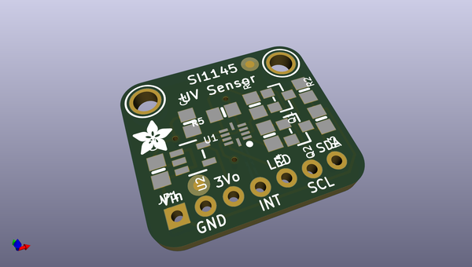
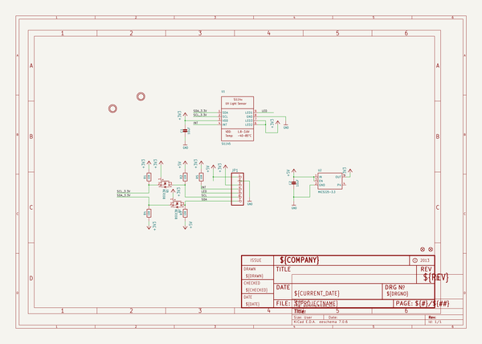
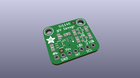
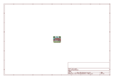
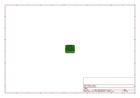
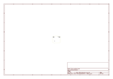
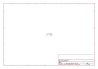

# OOMP Project  
## Adafruit-Si1145-Light-Sensor-PCB  by adafruit  
  
(snippet of original readme)  
  
-- Adafruit Si1145 Light Sensor PCB  
<a href="http://www.adafruit.com/products/1777">   
Click here to purchase one from the Adafruit shop</a>  
  
The SI1145 is a new sensor from SiLabs with a calibrated light sensing algorithm that can calculate UV Index. It doesn't contain an actual UV sensing element, instead it approximates it based on visible & IR light from the sun. We took this outside a couple days and compared the calculated UV index with the news-reported index and found it was very accurate! It's a digital sensor that works over I2C so just about any microcontroller can use it. The sensor also has individual visible and IR sensing elements so you can measure just about any kind of light - we only wrote our library to printout the 'counts' rather than the calculate the exact values of IR and Visible light so if you need precision Lux measurement check out the TSL2561. If you're feeling really advanced, you can connect up an IR LED to the LED pin and use the basic proximity sensor capability that is in the SI1145 as well.  
  
PCB files for the Adafruit Si1145 Light Sensor. The format is EagleCAD schematic and board layout  
- https://www.adafruit.com/product/1777  
  
--- License  
  
Adafruit invests time and resources providing this open source design, please support Adafruit and open-source hardware by purchasing products from [Adafruit](https://www.adafruit.com)!  
  
All text above must be included in any redistribution  
  
Designed   
  full source readme at [readme_src.md](readme_src.md)  
  
source repo at: [https://github.com/adafruit/Adafruit-Si1145-Light-Sensor-PCB](https://github.com/adafruit/Adafruit-Si1145-Light-Sensor-PCB)  
## Board  
  
  
## Schematic  
  
  
  
[schematic pdf](working_schematic.pdf)  
## Images  
  
  
  
  
  
  
  
  
  
  
  
  
  
  
  
  
