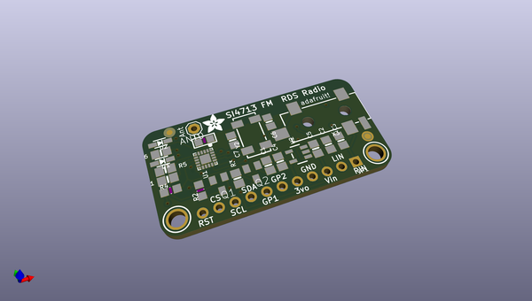
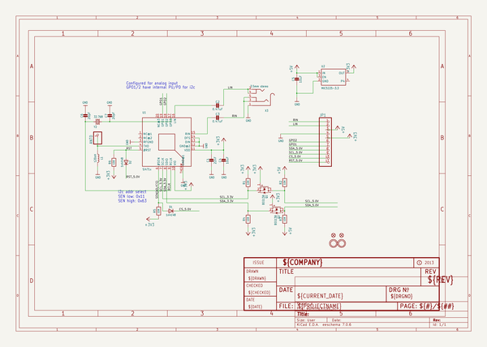
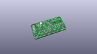
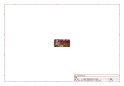
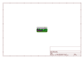
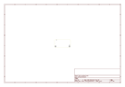
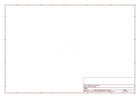
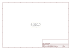

# OOMP Project  
## Adafruit-Si4713-PCB  by adafruit  
  
(snippet of original readme)  
  
- Adafruit Si4713 FM Transmitter Breakout PCB  
<a href="http://www.adafruit.com/products/1958">   
Click here to purchase one from the Adafruit shop</a>  
  
Become your very own pirate radio station with this FM radio transmitter. This breakout board, based on the best-of-class Si4713, is an all-in-one stereo audio FM transmitter that can also transmit RDS/RBDS data!  
  
Wire up to your favorite microcontroller (we suggest an Arduino) to the I2C data lines to set the transmit frequency and play line-level audio into the stereo headphone jack. Boom! Now you are the media. Listen using any FM receiver such as your car or pocket radio receiver - this is an easy way to transmit audio up to about 10 meters / 30 feet away.  
  
PCB files for Adafruit Si4713 FM Transmitter Breakout. The format is EagleCAD schematic and board layout  
- https://www.adafruit.com/product/1958  
  
--- License  
  
Adafruit invests time and resources providing this open source design, please support Adafruit and open-source hardware by purchasing products from [Adafruit](https://www.adafruit.com)!  
  
All text above must be included in any redistribution  
  
Designed by Limor Fried/Ladyada for Adafruit Industries.  
Creative Commons Attribution/Share-Alike, all text above must be included in any redistribution.   
See license.txt for additional information.  
  
  full source readme at [readme_src.md](readme_src.md)  
  
source repo at: [https://github.com/adafruit/Adafruit-Si4713-PCB](https://github.com/adafruit/Adafruit-Si4713-PCB)  
## Board  
  
  
## Schematic  
  
  
  
[schematic pdf](working_schematic.pdf)  
## Images  
  
  
  
  
  
  
  
  
  
  
  
  
  
  
  
  
